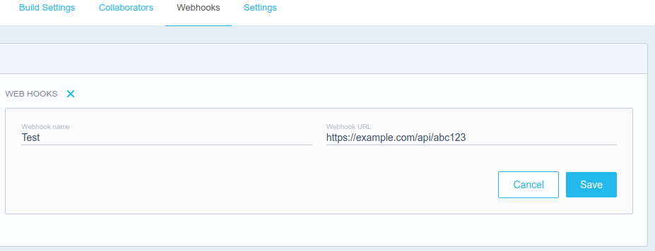

[](https://travis-ci.org/maccyber/dockerhub-webhook)
[](https://github.com/feross/standard)
[](https://coveralls.io/github/maccyber/dockerhub-webhook)
[](https://codeclimate.com/github/maccyber/dockerhub-webhook)

# dockerhub-webhook

**Unsupported!** See [maccyber/micro-dockerhub-hook](https://github.com/maccyber/micro-dockerhub-hook) instead.

Automatic [docker](https://www.docker.com) deployment with [webhooks](https://docs.docker.com/docker-hub/builds/#webhooks).

dockerhub-webhook listens to incoming HTTP POST-requests from hub.docker.com and triggers your specified script(s).

## Features

* Lightweight
* Pretty simple setup process
* Can be runned in a docker container
* Supports updating multiple docker images
* Scripts can trigger docker or docker-compose
* Used in production
* Good logging

# Create a token
Create a secret token with ``openssl``, ``uuidgen`` or something else. Don't use any slashes since token is going to be used in the URL.

```sh
export TOKEN=$(uuidgen)
echo $TOKEN
```

# Installation alternatives

## 1. Run on host

### Install

Nodejs and npm must be installed.

```sh
git clone http://github.com/maccyber/dockerhub-webhook
cd dockerhub-webhook
npm i
```

### Edit config

See [config/index.js](config/index.js)

```sh
vim config/index.js
```

### Configure repos and scripts

See [scripts/index.js](scripts/index.js)

```sh
vim scripts/index.js
```

### Start dockerhub-webhook
```sh
npm start
```

## 2. Run with docker-compose

Git clone
```sh
git clone http://github.com/maccyber/dockerhub-webhook
```

Add secret token in dockerhub.env with
```sh
vim dockerhub.env
```

Start with
```sh
docker-compose up -d
```

## 3. Run from docker hub

Git clone
```sh
git clone http://github.com/maccyber/dockerhub-webhook
```

Start with
```sh
docker run -d \
  -p 3000:3000 \
  -e SERVER_PORT=3000 \
  -e TOKEN=${token} \
  -e ROUTE=/api \
  -v ${PWD}/scripts:/src/scripts \
  -v /var/run/docker.sock:/var/run/docker.sock \
  --name dockerhub-webhook \
  maccyber/dockerhub-webhook 
```

# Configuration on docker hub

Go to https://hub.docker.com/ -> your repo -> Webhooks

Add a webhook like on the following image.



Replace ``example.com`` with the domain of your server or it's ip address.

Replace ``abc123`` with your secret token.

docker-hook listens to port 3000 by default. 
