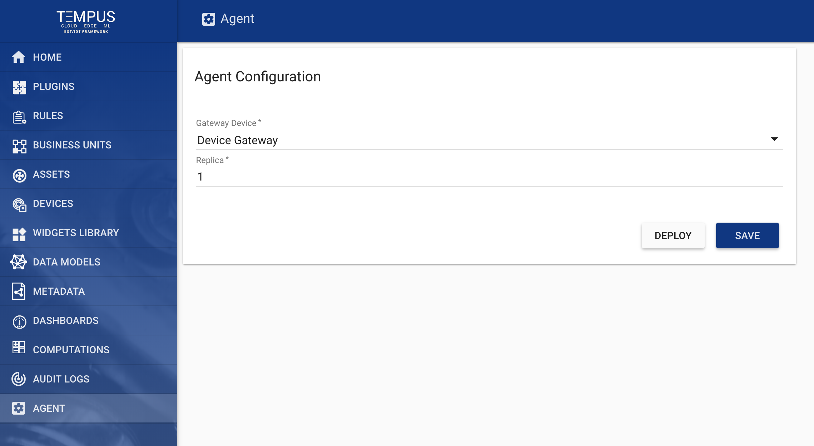
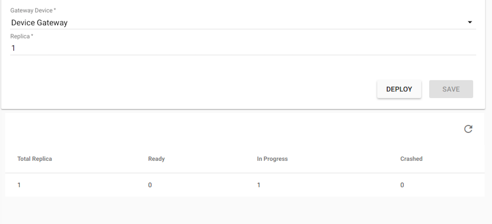

#######
Agent
#######

Tempus support configuring and deploying agent. Agent is nothing but tempus-gateway
that allows you to integrate IoT devices connected to legacy and third-party systems with Tempus Cloud.

********************
Agent Configuration
********************

Currently agent configuration consists of two attributes which are:

* Gateway device - Select any gateway device from the list.
* Replicas - Represents number of instances of the agent for deployment. (Currently, supports single replica)

*****************
Agent Deployment
*****************

Once the agent configuration has been saved. It can deploy by clicking on deploy button.
Here is the screenshot representing how the status will look after clicking on deploy:

