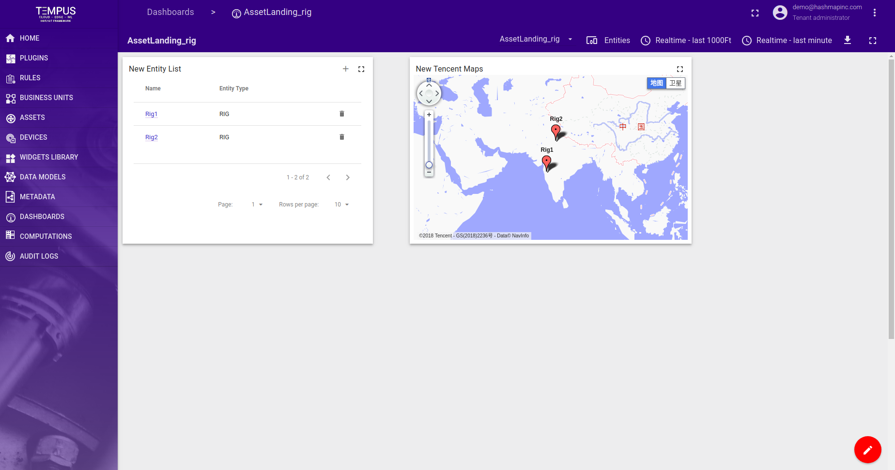

######
Asset Landing Dashboard
######

Tempus supports following asset landing dashboard features using Web UI and :doc:`../api/swagger`.

**********************
Create Asset Landing Dashboard
**********************

Data model is required to create asset landing dashboard.Created one data model named asset_datamodel which
having well and rig assets.

User can create asset landing dashboard from dashboard tab.To create asset landing dashboard need to give following:

- **Title** - the name of the asset landing dashboard.
- **Description** - the description of the asset landing dashboard.
- **Asset Landing Flag** - checked checkbox to set asset landing dashboard.
- **Data Model** - Select associated data model.
- **Asset of selected data model** - select asset from selected data model.

**********************
Add entity widget to create asset
**********************

To create asset from entity widget, add entity widget into asset landing dashboard.After adding widget clicked on + button to create
rig type assets.

User can create asset from landing dashboard.To create asset need to give following:

- **Name** - the name of the asset.
- **Description** - the description of the asset.
- **Assign Business Unit** - Assign asset to bussiness unit.
- **Add relation** - If asset have parent, then in add parent relation.

Added rig with map widget.

This Landing page is assign to business Unit.If User logined in, will see asset stepper. As following

