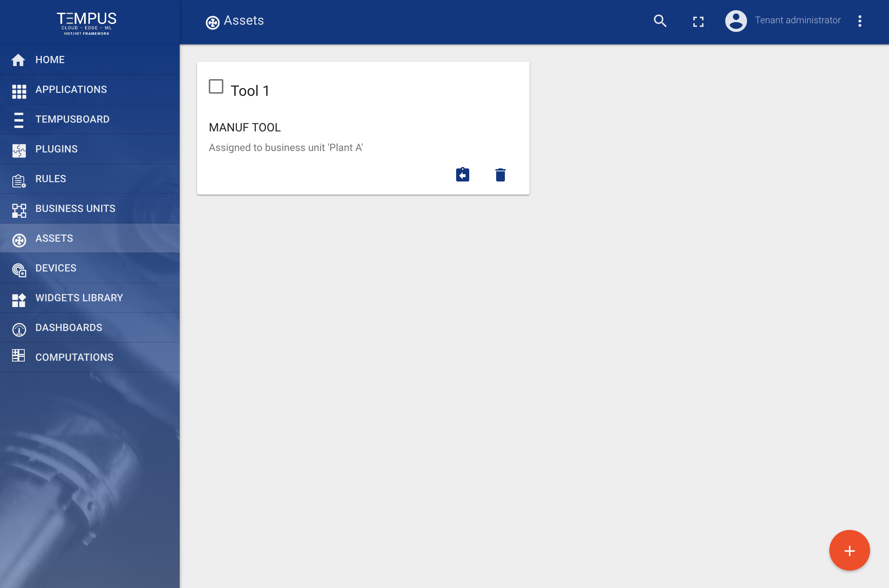
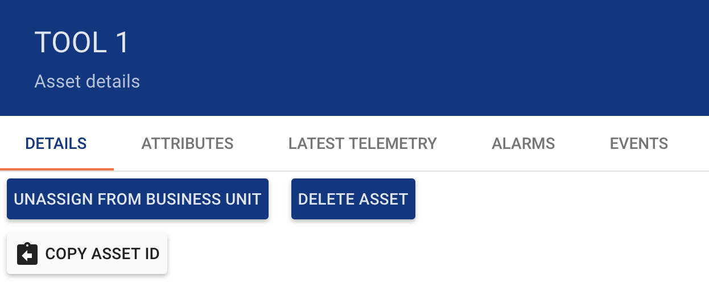
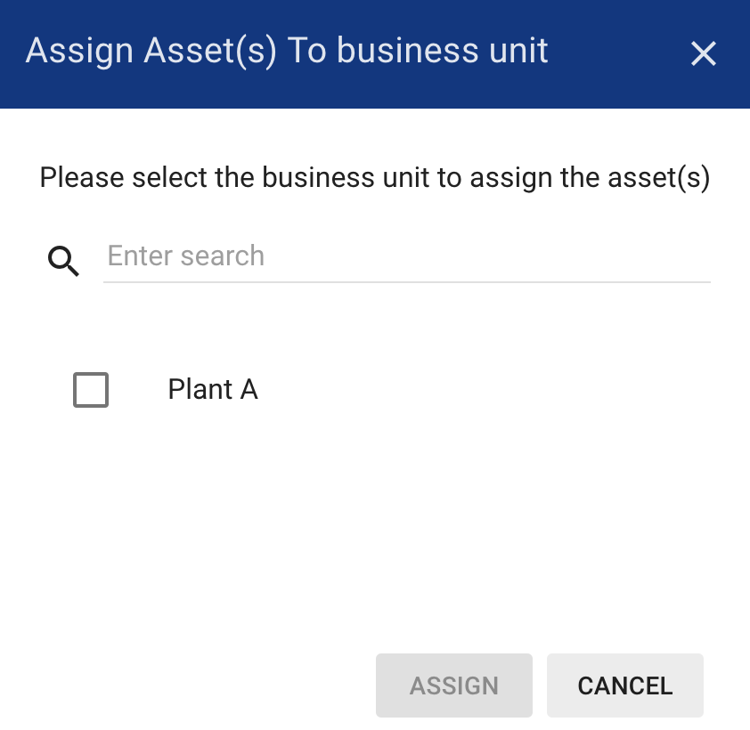
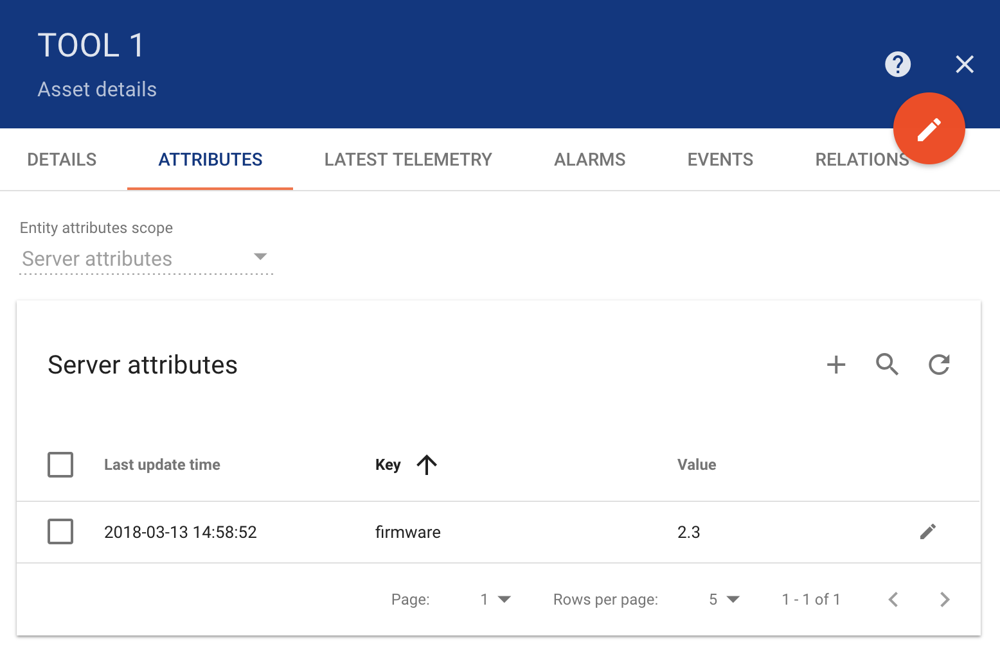
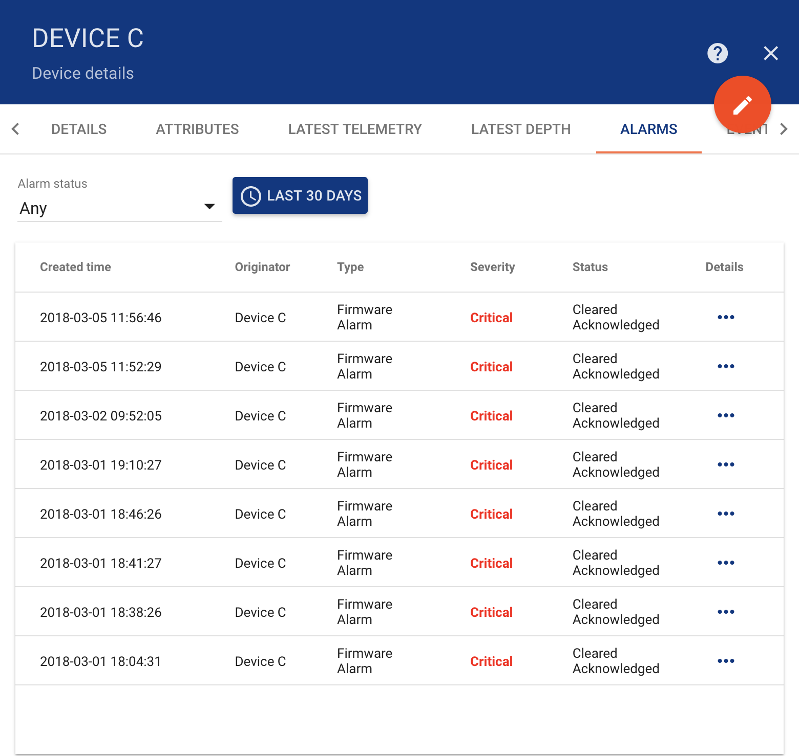
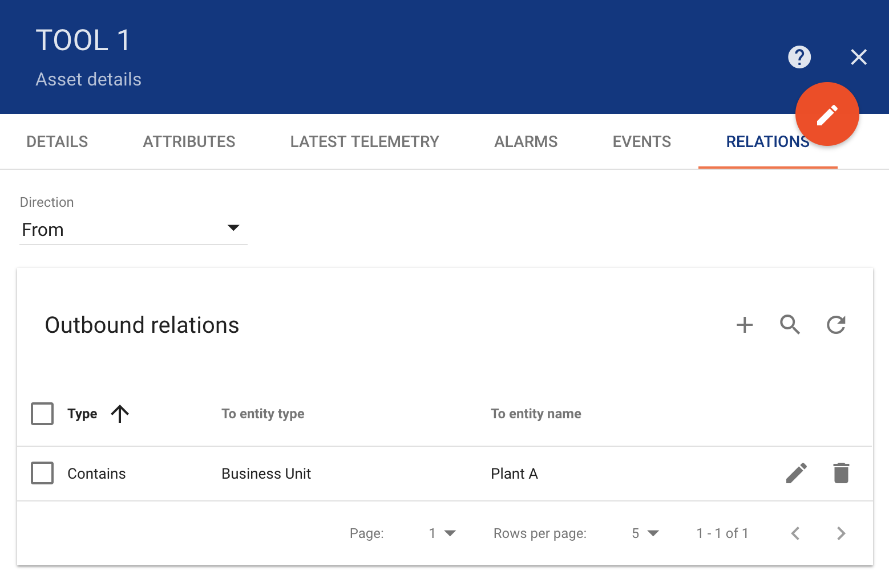

######
Assets
######

Tempus supports following asset management features using Web UI and :doc:`../api/swagger`.

*********************
Add and delete assets
*********************

Tenant administrator is able to register new assets or delete them from Tempus.

************
Get Asset Id
************

Tenant administrator and business unit users are able to copy asset id to clipboard using “Copy Asset Id” button.

*******************************
Assign assets to business units
*******************************

Tenant administrator is able to assign assets to certain business unit. This will allow Customer users to fetch asset data using REST APIs or Web UI.

***********************
Manage asset attributes
***********************
Tenant administrator and business unit users are able to manage asset server-side attributes.

*******************
Browse asset alarms
*******************

Tenant administrator and business unit users are able to browse asset alarms.

*******************
Browse asset events
*******************

Tenant administrator and business unit users are able to browse events related to particular asset using “Events” tab. Lifecycle events and statistics are coming soon.

**********************
Manage asset relations
**********************

Tenant administrator and business unit users are able to manage asset relations.

