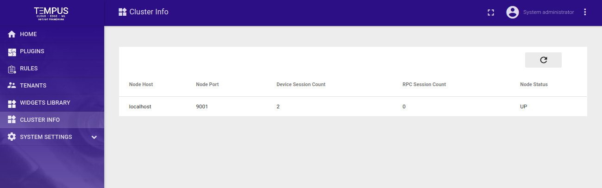

###################
Cluster Information
###################

Tempus supports following cluster information feature using Web UI.

**System administrator** is able to check how the load is distributed over different nodes in a cluster using **Cluster Info** option in side-bar menu.

**System administrator** is able to see the nodes details.
Node details include the host, port, number of active device actor sessions, number of active rpc actor sessions and status of the node.

Cluster Information Web Ui will show the details of different nodes in cluster. To see updated values on cluster info Web UI page use refresh button on top right corner of the table.

