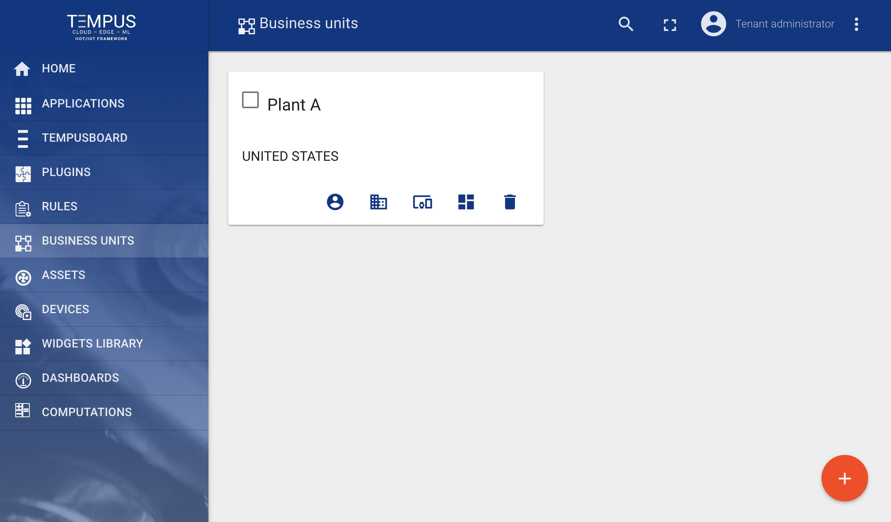
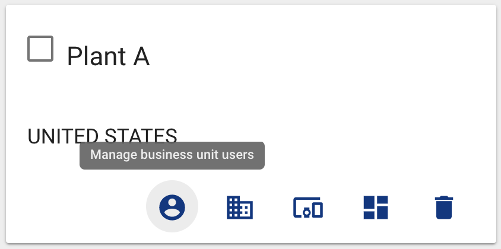
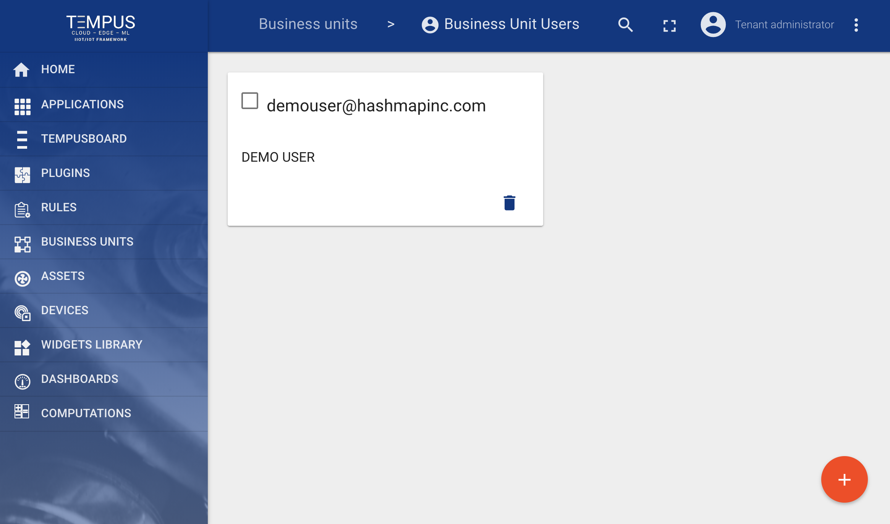
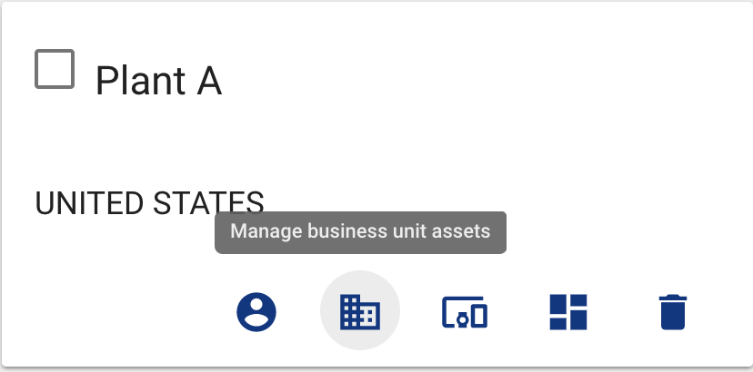
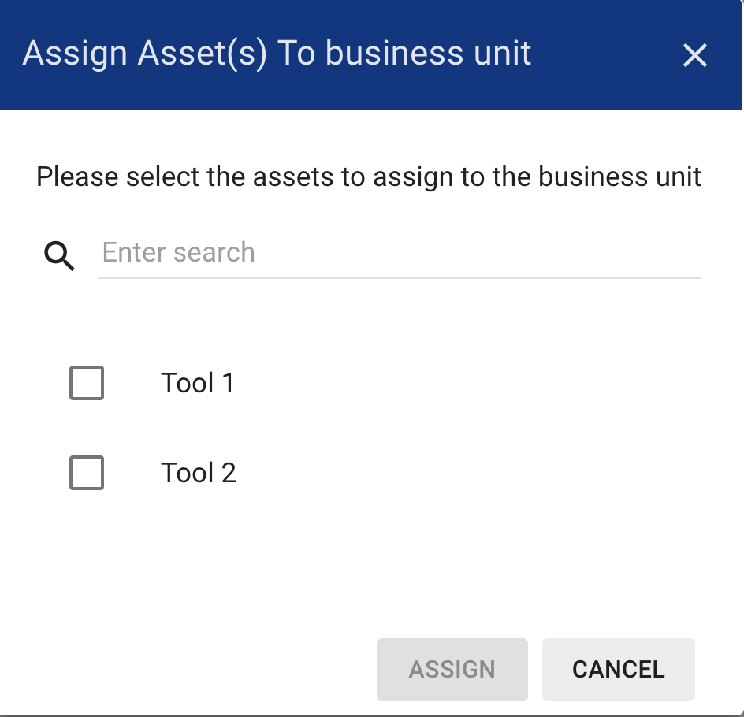
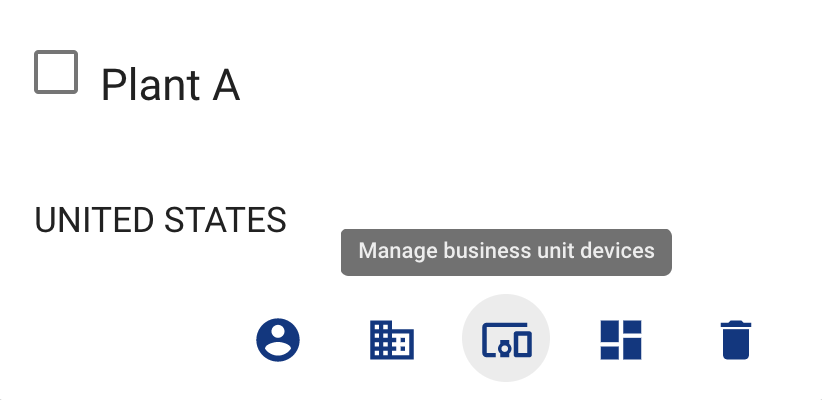
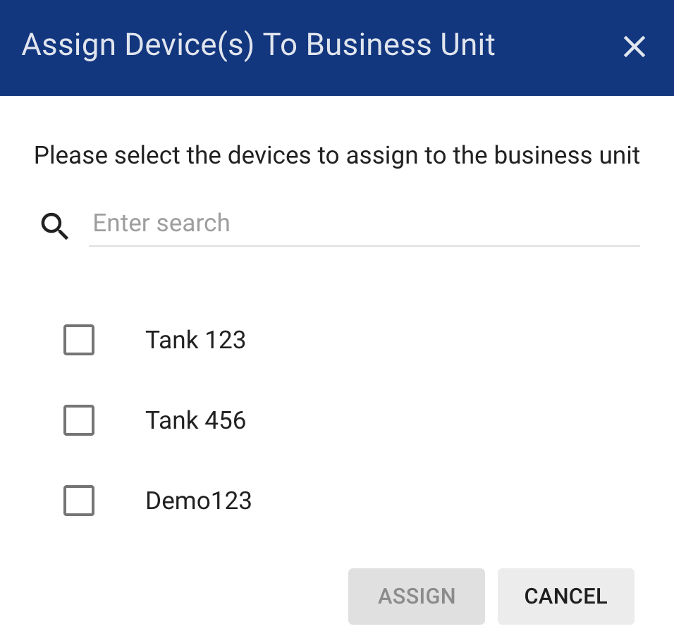
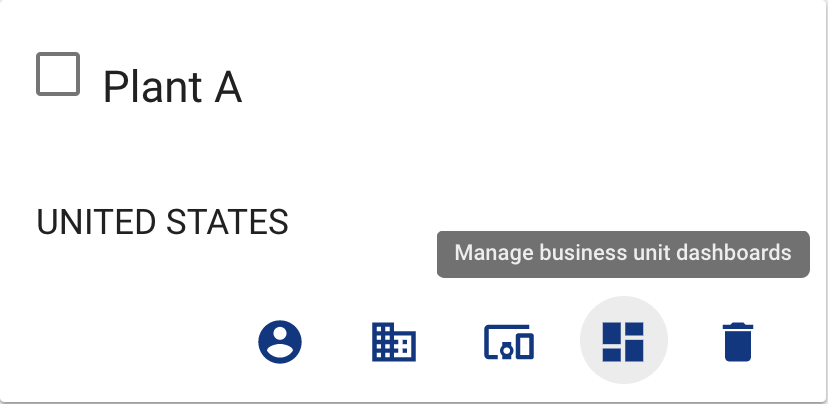

##############
Business Units
##############

Tempus supports following asset management features using Web UI.

*****************************
Add and delete business units
*****************************

Tenant administrator is able create new business unit or delete them from Tempus.

***************************
Manage business unit users
***************************

Tenant administrator is able to manage business unit users. 

==========================
Add users to business unit
==========================

Tenant administrator is able add Users to a business unit. 

****************************
Manage business unit assets
****************************

Tenant administrator is able to manage business unit assets. 

==============================
Assign assets to business unit
==============================

Tenant administrator is able assign assets to a business unit. 

*****************************
Manage business unit devices
*****************************

Tenant administrator is able to manage business units devices. 

===============================
Assign devices to business unit
===============================

Tenant administrator is able assign assets to a business unit. 

*******************************
Manage business unit dashboards
*******************************

Tenant administrator is able to manage business unit dashboards. 

==================================
Assign dashboards to business unit
==================================

Tenant administrator is able assign assets to a business unit. 

