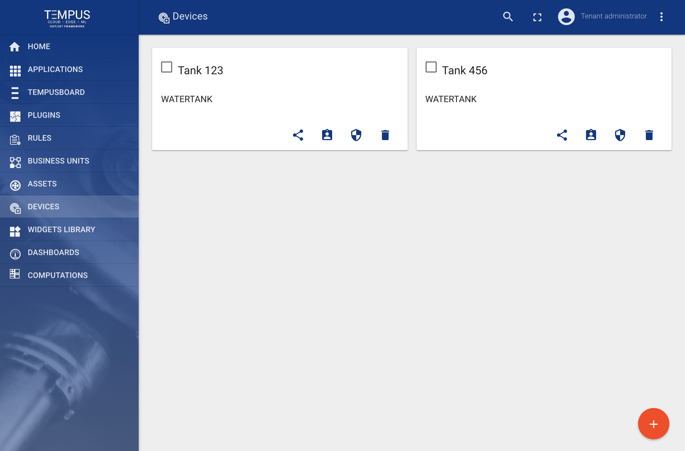
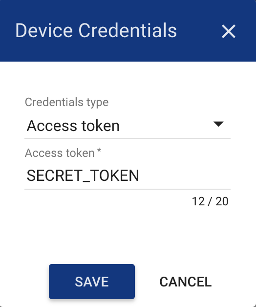
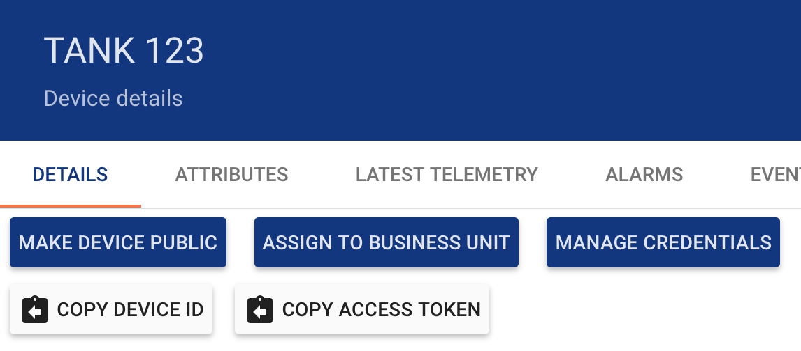
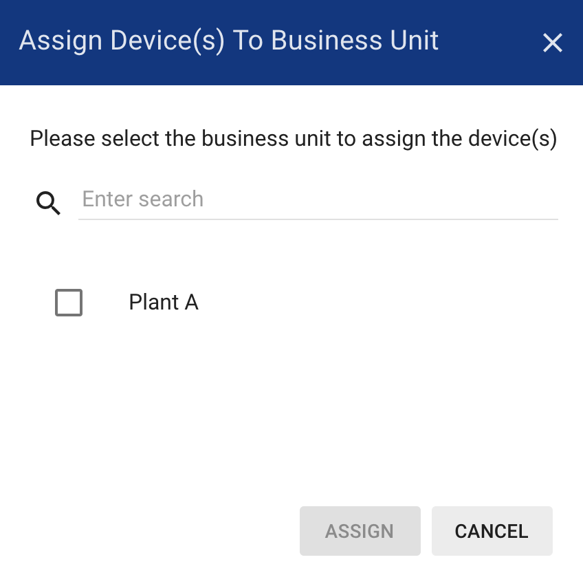
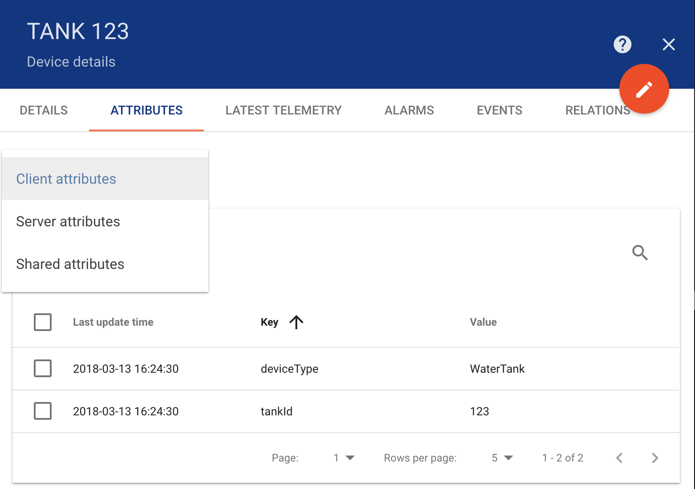
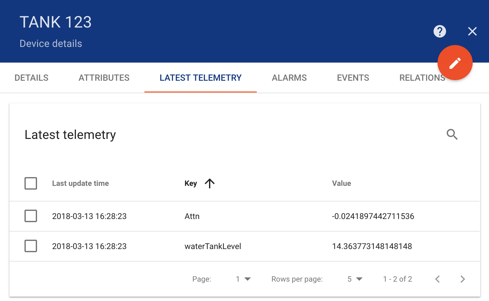
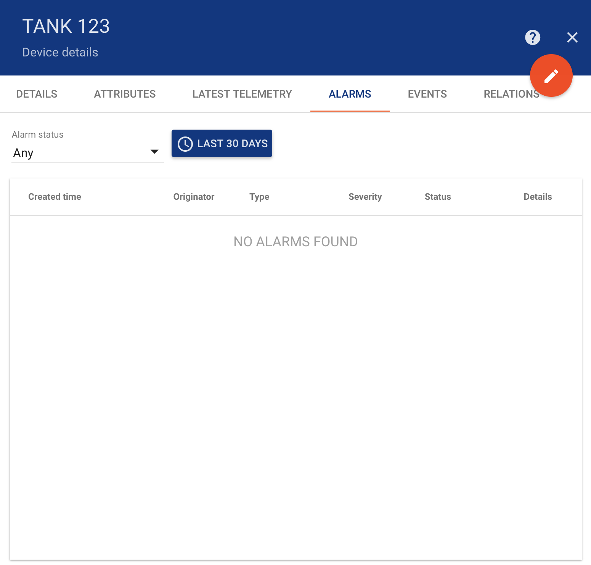
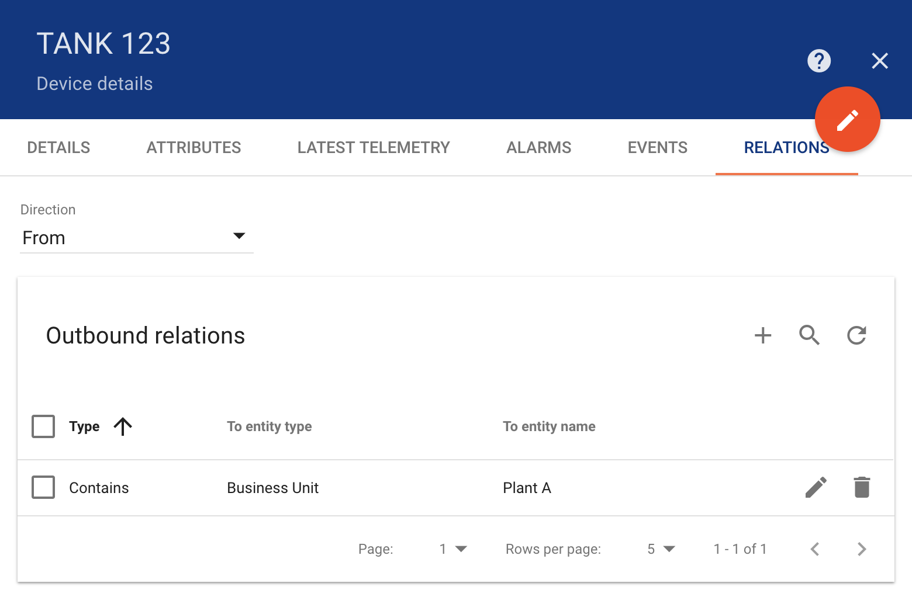

#######
Devices
#######

Tempus supports following device management features using Web UI and :doc:`../api/swagger`.

**********************
Add and delete devices
**********************

Tenant administrator is able to register new devices or delete them from Tempus.

.. _device-token-label:

Manage device credentials
*************************

Tenant administrator is able to manage device credentials. Current release supports Access Token and X.509 Certificates based credentials.

*************
Get Device Id
*************

Tenant administrator and business unit users are able to copy device id to the clipboard using “Copy Device Id” button.

********************************
Assign devices to business units
********************************

Tenant administrator is able to assign devices to certain business unit. This will allow Customer users to fetch device data using REST APIs or Web UI.

************************
Browse device attributes
************************

Tenant administrator and business unit users are able to browse device attributes.

***************************
Browse device telemetry
***************************

Tenant administrator and business unit users are able to browse device telemetry data.

********************
Browse device alarms
********************

Tenant administrator and business unit users are able to browse device alarms.

********************
Browse device events
********************

Tenant administrator and business unit users are able to browse events related to a particular device using “Events” tab. Lifecycle events and statistics are coming soon.

***********************
Manage device relations
***********************

Tenant administrator and business unit users are able to manage device relations.

