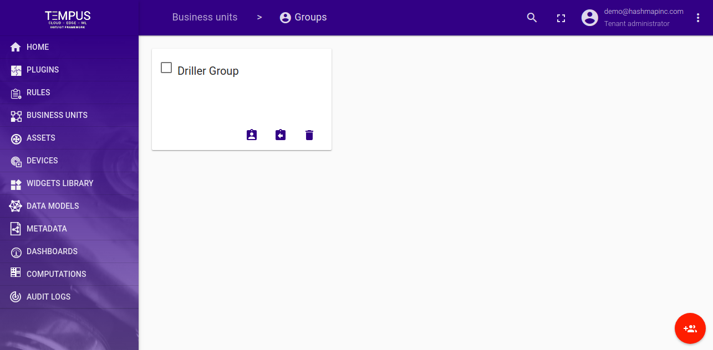
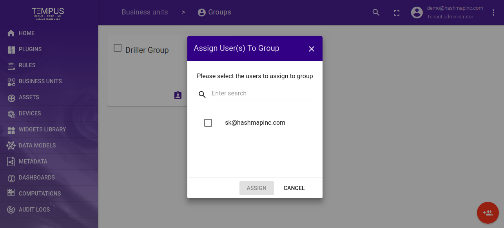
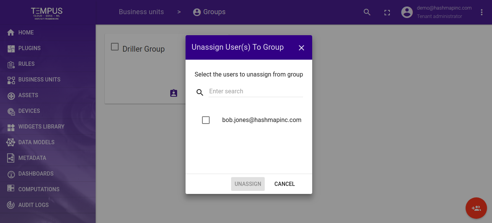
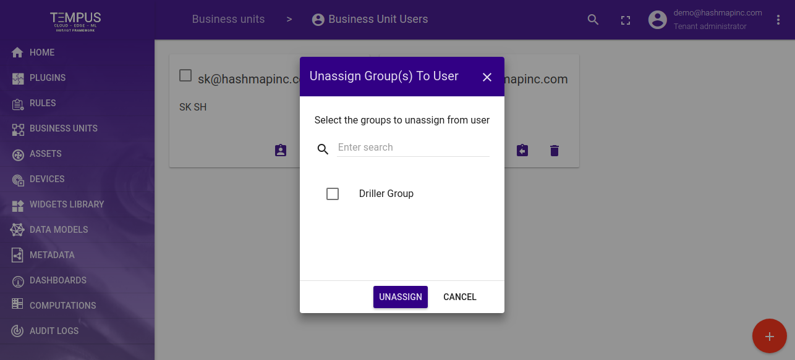

#############
Groups
#############

Tempus Tenant Administrator is able to create a group and can assign and unassign users to a specific group(s).

**********************
Groups Catalog
**********************

Clicking on the group icon from business unit page will land to the groups catalog page.

**********************
Add Group
**********************

Clicking on ADD buton a pop will appear for adding group to the system

.. image:: ../_images/admin/add_group.png
    :align: center
    :alt: Add Group

**********************
Assign/Unassign Users
**********************

Tenant admin can assign and unassign users form the groups.

**********************
Assign/Unassign Groups
**********************

Tenant admin can also assign/unassign groups from the User page.

