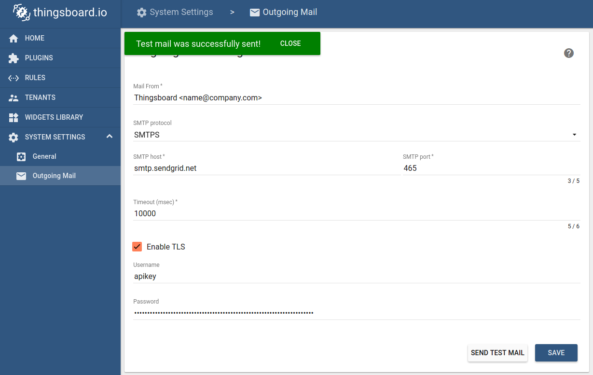
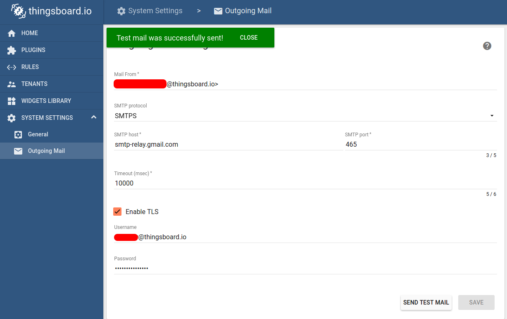

#############
Mail Settings
#############

Tempus System Administrator is able to configure a connection to a SMTP server that will be used to distribute activation and password reset emails to users. This configuration step is required in production environments. If you are evaluating the platform, pre-provisioned demo accounts are sufficient in most of the use cases.
NOTE System Mail settings are used only during user creation and password reset process and are controlled by a system administrator. Tenant administrator is able to setup email plugin to distribute alarms produced by rule engine.

* :ref:`step1-label`
* :ref:`step2-label`
* :ref:`step3-label`
  
  * :ref:`step31-label`
  * :ref:`step32-label`

* :ref:`step4-label`

Following steps are required to configure system mail settings.

.. _step1-label:

Step 1. Login as system administrator
*************************************
Login to your Tempus instance WEB UI as a system administrator using default account.

.. _step2-label:

Step 2. Change administrator email address
******************************************

Right click on the burger in the top-right corner of the WEB UI and select ‘Profile’. Change ‘sysadmin@hashmapinc.com’ to your email address. Now re-login as administrator again.

.. _step3-label:

Step 3. Open ‘Outgoing Mail’ and populate SMTP server settings
**************************************************************

Navigate to System Settings -> Outgoing Mail and populate the form. Click on ‘Send Test Email’ button. A test email will be sent to the email address that you have specified in ‘Step 2’. In case of error in configuration, you should receive a popup with the error log.

.. _step31-label:

Step 3.1. Sendgrid configuration example
========================================

SendGrid configuration is fairly simple and straightforward. First, you need to create `SendGrid <https://sendgrid.com/>`_ account. You can try it for free and the free plan is most likely enough for platform evaluation.
Once you create your account, you will be forwarded to the welcome page. Now you can provision your SMTP Relay credentials. See the screen-shot below.

.. image:: ../_images/admin/mail_sendgrid.png
    :align: center
    :alt: Send Grid Welcome

Please choose SMTP relay on the next page.

.. image:: ../_images/admin/mail_relay.png
    :align: center
    :alt: Send Grid SMTP relay

Once you populate the API key name and generate it, you will be able to copy-paste settings from the screen to Tempus mail settings form.

.. image:: ../_images/admin/mail_token.png
    :align: center
    :alt: Mail token 

Copy-paste the settings, update ‘Mail From’ field and click on ‘Send Test Mail’ button.

Once you receive the notification about a successfull test, save populated data. You can also complete verification on the SendGrid website.

.. image:: ../_images/admin/mail_it_works.png
    :align: center
    :alt: SendGrid It works

.. _step32-label:

Step 3.2. Gmail configuration example
=====================================

In order to use G-mail, you will need to do two extra steps. First, you need to `allow less secure apps <https://support.google.com/accounts/answer/6010255?hl=en/>`_. Second, you need to enable two-step verification and generate an `app password <https://support.google.com/accounts/answer/185833?hl=en/>`_. Although the second step is not mandatory, it is highly recommended.

.. image:: ../_images/admin/mail_app_password.png
    :align: center
    :alt: Mail App Password

Once this is ready, you should be able to setup Gmail account using the information below

.. image:: ../_images/admin/mail_gmail_settings.png
    :align: center
    :alt: Plugin

Similar settings are available for G-suite accounts, however, you may need to contact your system administrator to enable less secure apps, etc. Note that you can also enable/disable TLS using checkbox.

.. _step4-label:

Step 4. Save configuration
**************************

Once you will receive test email you can save SMTP server configuration.