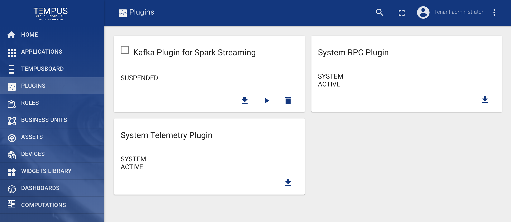
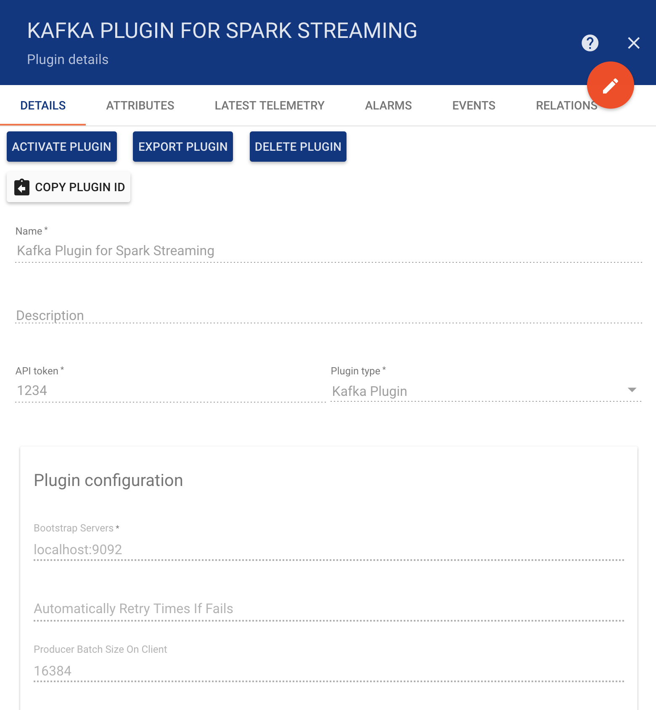
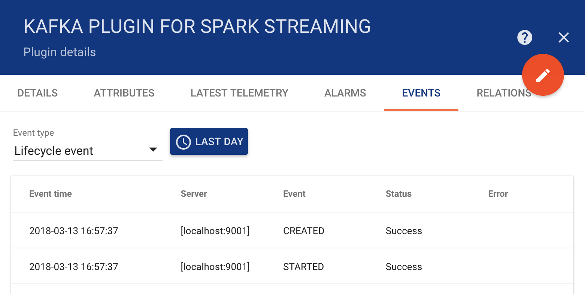
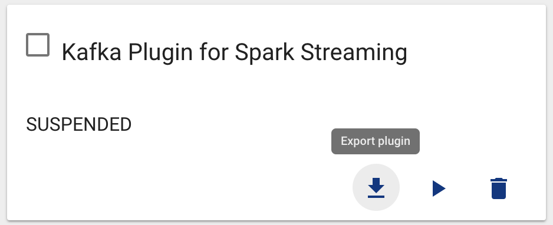
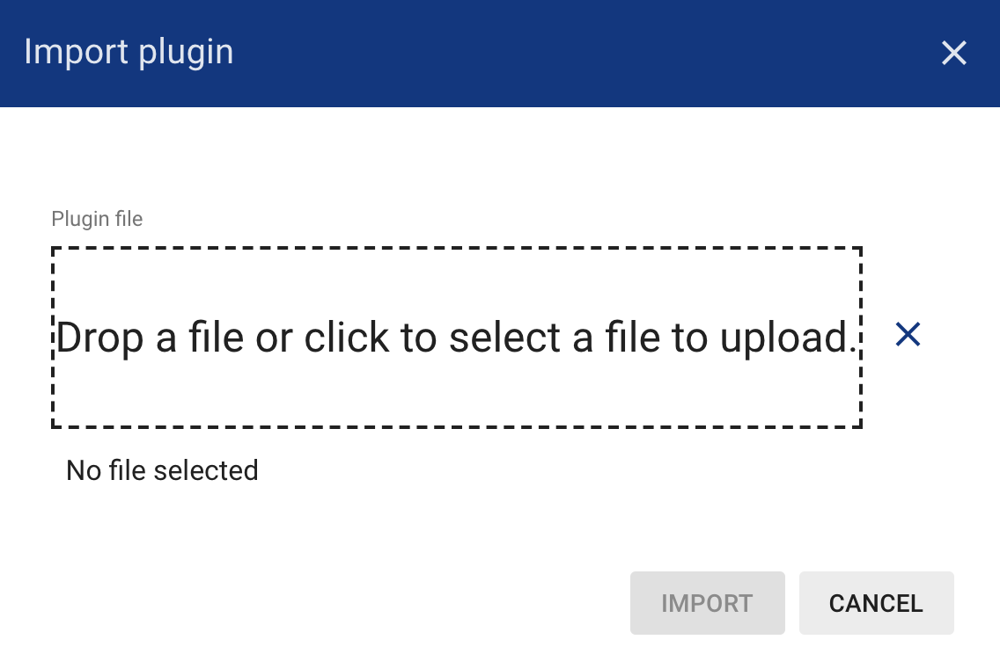

#######
Plugins
#######

************
Plugins page
************

Plugins Administration UI page displays a table of system and tenant specific plugins. Each plugin has a separate card. You are able to do following operations:

* Import Or Create new Plugin
* Export Plugin to JSON
* Suspend and Activate particular Plugin
* Delete the Plugin

See `Rule Engine` documentation for more details.

**************
Plugin details
**************

Each plugin is a represented as a separate card. You are able to edit plugin configuration and review the plugin events in the Plugin details panel.

You are also able to review plugin life-cycle events, stats, and errors during message processing. Please note that in case of frequent errors the error messages are sampled.

********************
Plugin import/export
********************

=============
Plugin export
=============

You are able to export your plugin to JSON format and import it to the same or another Tempus instance.
In order to export plugin, you should navigate to the Plugins page and click on the export button located on the particular plugin card.

=============
Plugin import
=============

Similar, to import the plugin you should navigate to the Plugins page and click on the big “+” button in the bottom-right part of the screen and then click on the import button.

**Note** All imported plugins are in the suspended state. Don’t forget to **activate** your plugin after import.

***************
Troubleshooting
***************

Possible issues while importing the plugin:

* The corresponding plugin API Token is **already reserved**. You can choose another token and edit it directly in the source json.
* The corresponding plugin implementation is **not available** in the server classpath.