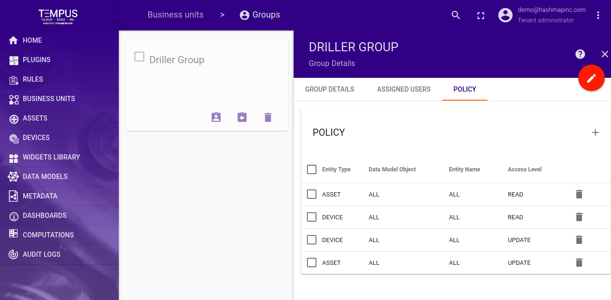
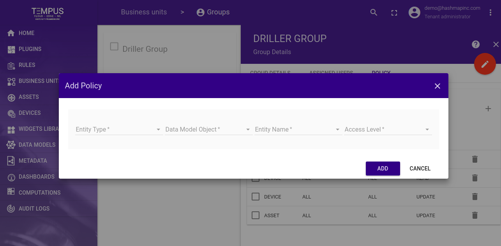

#############
Policy
#############

Tempus Tenant Administrator can create a policy for a particular group

**********************
Policy Tab
**********************

Clicking on the group card will open a right pane and in that there will be a policy tab which will show all the assigned policies to a group

**********************
Add Policy 
**********************

On policy tab there is a add button clicking on that a pop will appear for adding policy.

