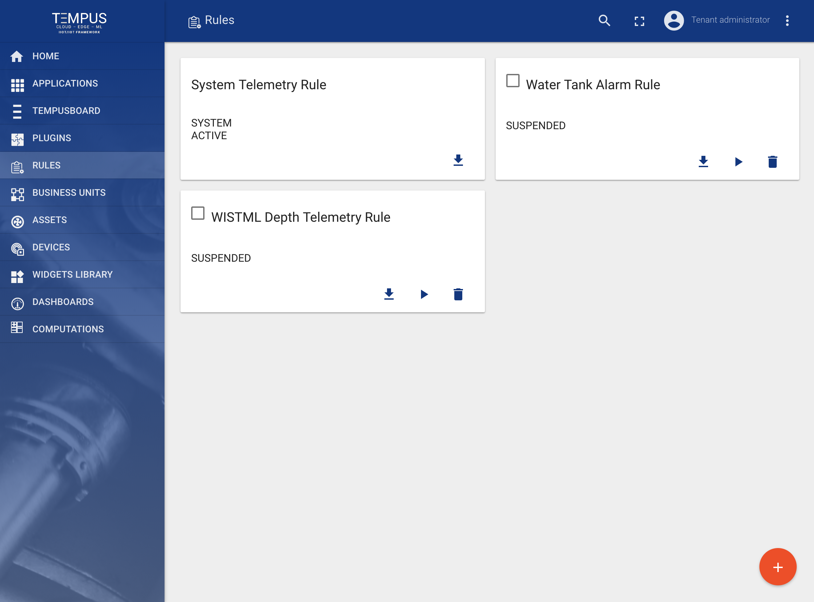
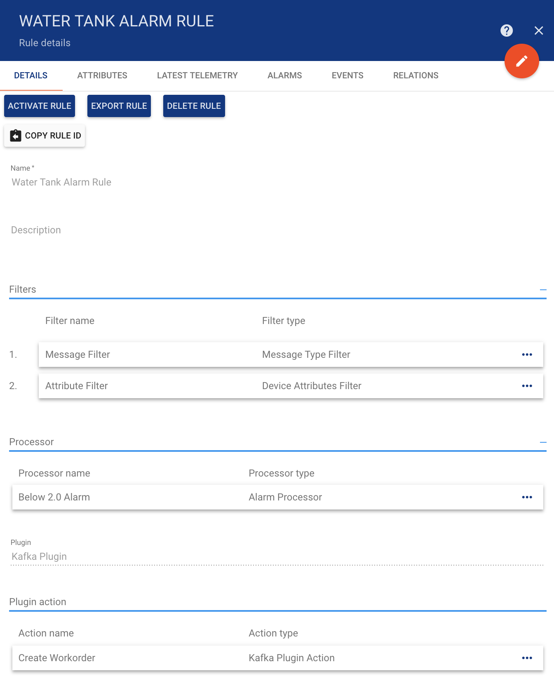
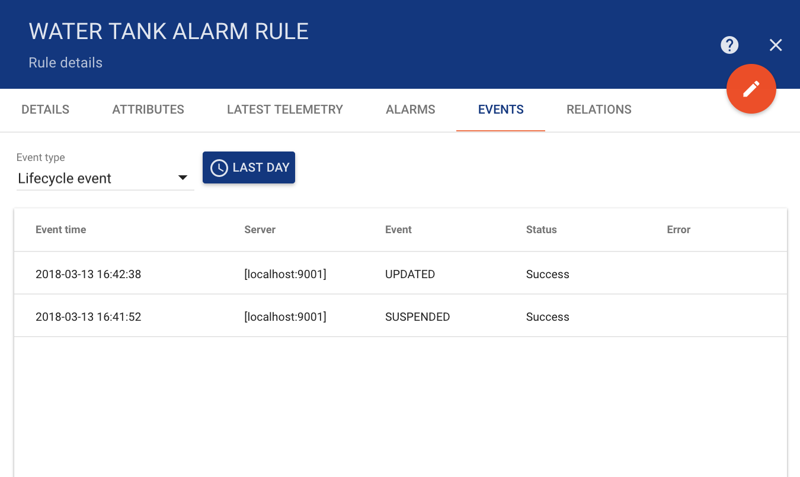
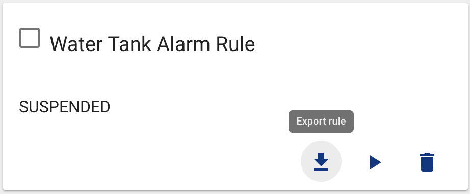
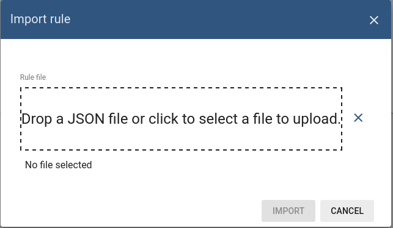

#######
Rules
#######

**********
Rules page
**********

Rules Administration UI page displays a table of system and tenant specific rules. Each rule has a separate card. You are able to do following operations:

* Import Or Create new Rule
* Export Rule to JSON
* Suspend and Activate particular Rule
* Delete the Rule

See `Rule Engine` documentation for more details.

*************
Rules details
*************

Each rule is a represented as a separate card. You are able to edit rule components and review the rule events in the Rule details panel.

You are also able to review rule life-cycle events, rule stats, and errors during message processing. Please note that in case of frequent errors the error messages are sampled.

*******************    
Rules import/export
*******************

===========
Rule export
===========

You are able to export your rule to JSON format and import it to the same or another Tempus instance.
In order to export rule, you should navigate to the **Rules** page and click on the export button located on the particular rule card.

===========
Rule import
===========

Similar, to import the rule you should navigate to the **Rules** page and click on the big “+” button in the bottom-right part of the screen and then click on the import button.

**Note** All imported rules are in the suspended state. Don’t forget to **activate** your rule after import.

***************
Troubleshooting
***************

Possible issues while importing the rule:

* The corresponding target plugin is not imported.
* The corresponding target plugin is not activated.