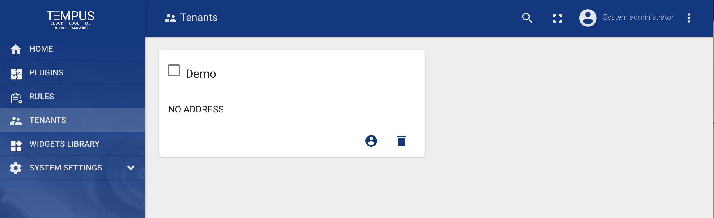

#######
Tenants
#######

Tempus support `Multitenancy <https://en.wikipedia.org/wiki/Multitenancy/>`_ out-of-the-box. You can treat Tempus tenant as a separate business-entity: individual or organization who owns or produce devices.

**System administrator** is able to create tenant entities.

System administrator is also able to create multiple users with **Tenant Administrator** role for each tenant by pressing “Manage Tenant Admins” button in Tenant details.
 
 .. image:: ../_images/admin/tenants_details.png
    :align: center
    :alt: Tenant Details

Tenant Administrator is able to do following actions:

* Provision and Manage :doc:`devices`
* Provision and Manage :doc:`assets`
* Create and Manage :doc:`customers`
* Create and Manage :doc:`dashboards`
* Configure :doc:`rules` and :doc:`plugins`
* Add or modify default widgets using :doc:`widgets`

All actions listed above are available using :doc:`../api/swagger`