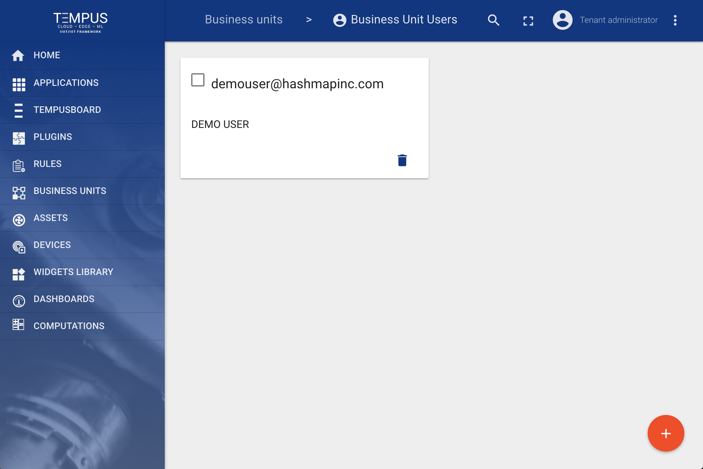
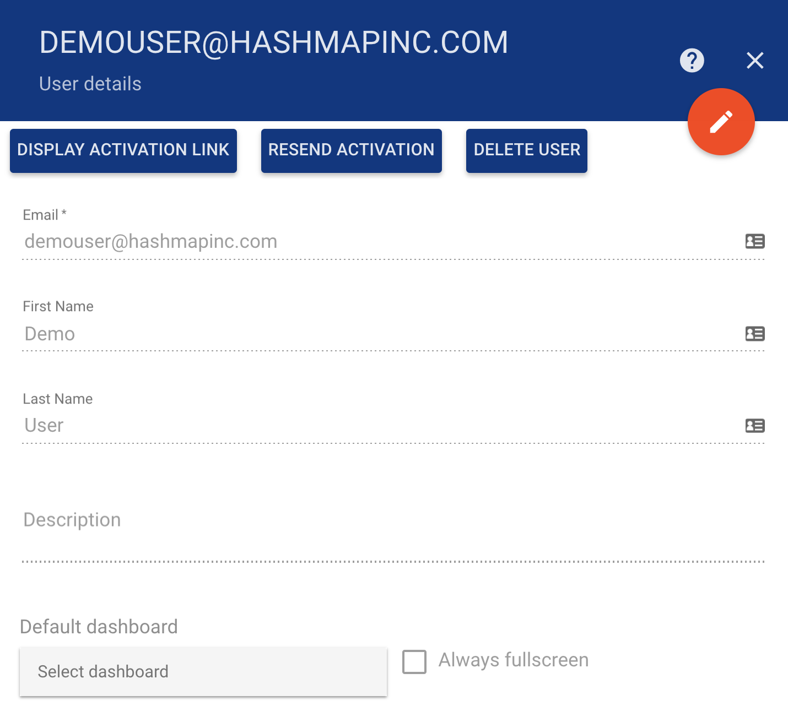
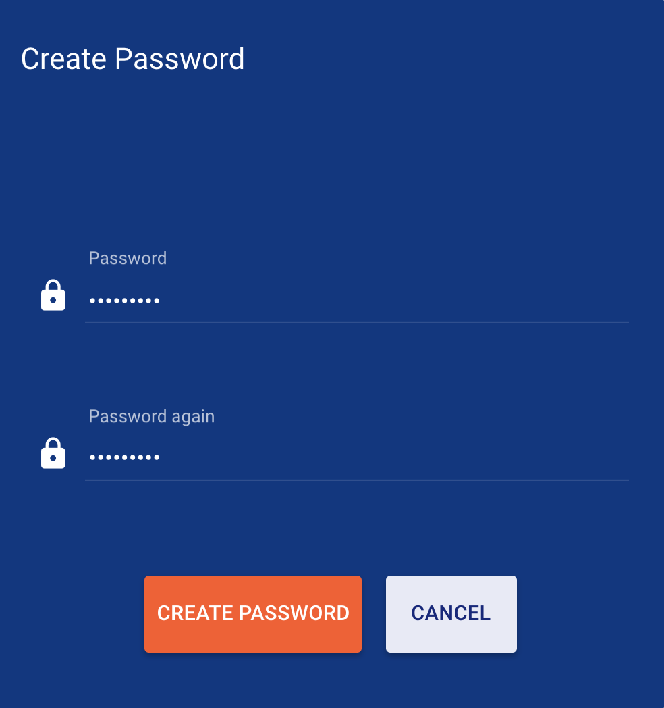

#####
Users
#####

Tempus supports following user management features using Web UI.

********************
Add and delete users
********************

Tenant administrator is able add and delete users to business unit.

*********************
User activation links
*********************

Tenant administrator is display or resend a user thier activation link

***********************
Display activation link
***********************

Activation link is provided for a user to activate an account and create a password.

.. image:: ../_images/admin/users_activate_link.png
    :align: center
    :alt: User activation links

********************
Create user password
********************

The user activation link prompts the user to create a password.

