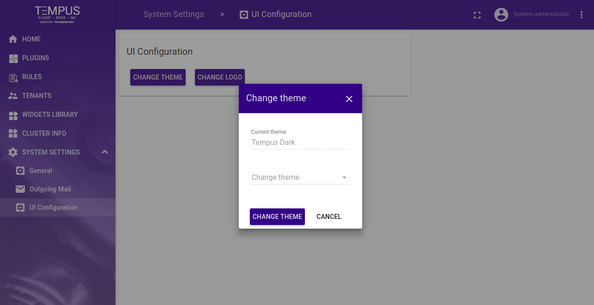
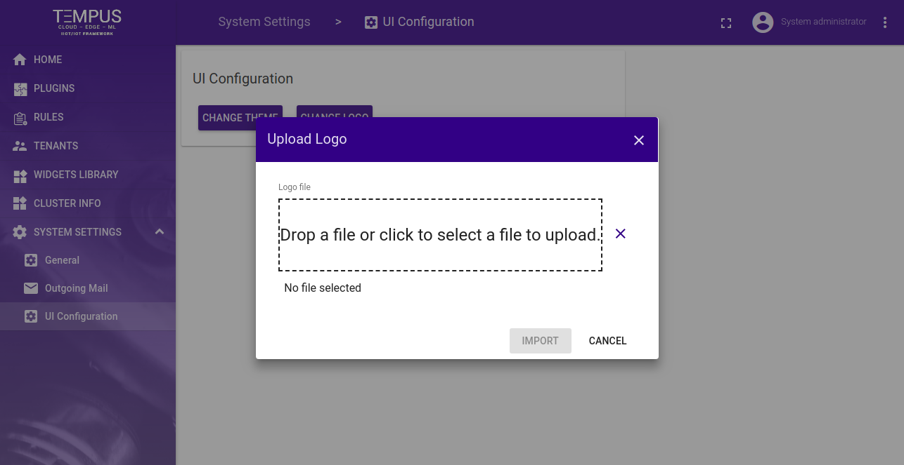

#############
WhiteLabeling
#############

Tempus System Administrator is able to configure a Theme depending on there branding, also System Administrator can change the default Logo for the application.

**********************
Change Theme
**********************

System Administrator can change the Theme on the system which will be applicable to all the Users,Tenant admin and Customers.

**********************
Change Logo
**********************

System Administrator can change the Logo on the system which will be applicable to all the Users,Tenant admin and Customers.

