##############
Widget Library
##############

************
Introduction
************

All IoT :doc:`dashboards` are constructed using Tempus widgets that are defined in Widget Library. Each widget provides end-user functions such as data visualization, remote device control, alarms management and displaying static custom html content.

************
Widget Types
************

According to the provided features, each widget definition represents specific widget type. At the moment there are five widget types:

* :ref:`latest-label`
* :ref:`time-label`
* :ref:`rpc-label`
* :ref:`alarm-label`
* :ref:`static-label`

Each widget type has own specific datasource configuration and corresponding widget API. Each widget requires datasource for data visualization. Types of the available datasource depend on widget type of the widget:

* Target device - this datasource type is used in RPC. Basically, you need to specify target device for RPC widget
* Alarm source - this datasource type is used in Alarm widgets. This datasource requires source entity to display related alarms and corresponding alarm fields.
* Entity - this datasource type is used in both time-series and latest values widgets. Basically, you need to specify target entity and timeseries key or attribute name.
* Function - this datasource type is used in both time-series and latest values widgets for debug purposes. Basically, you are able to specify a javascript function that will emulate data from a device in order to tune visualization.

.. _latest-label:

Latest values
=============

Displays latest values of particular entity attribute or timeseries data point (for ex. any Gauge Widget or Entities Table widget). This kind of widgets uses values of entity attribute(s) or timeseries as datasource.

.. image:: ../_images/admin/widgets_latest_values.png
    :align: center
    :alt: Latest values datasource 

Below is an example of latest values widget - Digital Gauge displaying current power value.

.. image:: ../_images/admin/widget_latest_values_example.png
    :align: center
    :alt: Latest values digital gauge

.. _time-label:

Time-series
===========
Displays historical values for the selected time period or latest values in the certain time window (for ex. “Timeseries - Flot” or “Timeseries table”). This kind of widgets uses only values of entity timeseries as datasource. In order to specify the time frame of displayed values, Timewindow settings are used. Timewindow can be specified on the dashboard level or on the widget level. It can be either realtime - dynamically changed time frame for some latest interval, or history - fixed historical time frame. All these settings are part of Time-series widget configuration.

.. image:: ../_images/admin/widgets_time_series.png
    :align: center
    :alt: Timeseries datasource 

Below is an example of time series widget - “Timeseries - Flot” displaying amperage values of three devices in real-time.

.. image:: ../_images/admin/widget_time_series_example.png
    :align: center
    :alt: Timeseries digital gauge

.. _rpc-label:

RPC (Control widget)
====================

Allows to send RPC commands to devices and handles/visualize reply from the device (for ex. “Raspberry Pi GPIO Control”). RPC widgets are configured by specifying target device as target endpoint for RPC commands.

.. image:: ../_images/admin/widgets_rpc.png
    :align: center
    :alt: RPC data 

Below is an example of RPC widget - “Basic GPIO Control” - sending GPIO switch commands and detecting current GPIOs switch status.

.. image:: ../_images/admin/widgets_rpc_example.png
    :align: center
    :alt: RPC Widget example

.. _alarm-label:

Alarm Widget
============

Display alarms related to the specified entity in the certain time window (for ex. “Alarms table”). Alarm widgets are configured by specifying entity as alarms source and corresponding alarm fields. Like Time-series widgets alarm widgets have the timewindow configuration in order to specify the time frame of displayed alarms. Additionally configuration contains “Alarm status” and “Alarms polling interval” parameters. “Alarm status” parameter specifies the status of alarms being fetched. “Alarms polling interval” controls alarms fetching frequency in seconds.

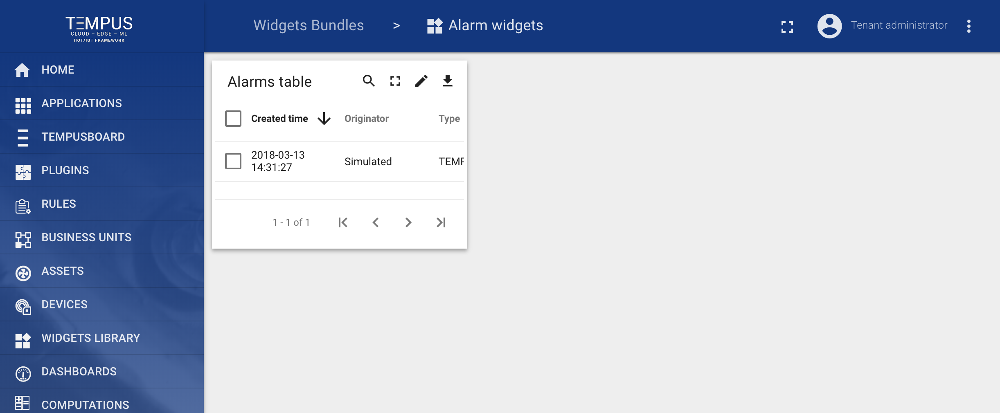

Below is an example of Alarm widget - “Alarms table” displaying latest alarms for the asset in real-time.

.. image:: ../_images/admin/widgets_alarm_example.png
    :align: center
    :alt: Alarm widget example 

.. _static-label:

Static
======

Displays static customizable html content (for ex. “HTML card”). Static widgets don’t use any datasources and usually configured by specifying static html content and optionally css styles.

.. image:: ../_images/admin/widgets_static.png
    :align: center
    :alt: Static HTML 

Below is an example of a Static widget - “HTML card” displaying specified html content.

.. image:: ../_images/admin/widgets_static_example.png
    :align: center
    :alt: Staic widget example 

*************************
Widgets Library (Bundles)
*************************

Widget definitions are grouped into widget bundles according to their purpose. There are System level and Tenant level **Widgets Bundles**. Initial Tempus installation is shipped with the basic set of system level **Widgets Bundles**. There are more than thirty widgets in seven widget bundles available out-of-the-box. System level bundles can be managed by a **System administrator** and are available for use by any tenant in the system. Tenant level bundles can be managed by a **Tenant administrator** and are available for use only by this tenant and its business units. You can always implement and add your widgets by following this guide.

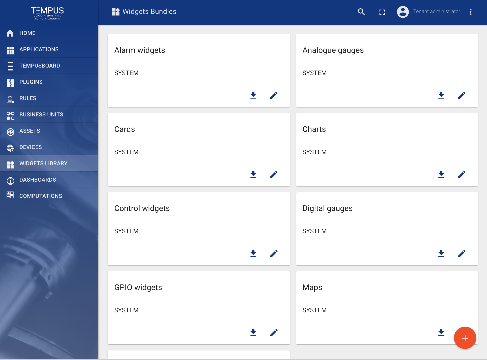

Digital Gauges
==============

Useful for visualization of temperature, humidity, speed and other integer or float values.

.. image:: ../_images/admin/widgets_digital_gauges.png
    :align: center
    :alt: Digital Gauges

==============
Analog Gauges
==============

Similar to digital gauges, but have a different style.

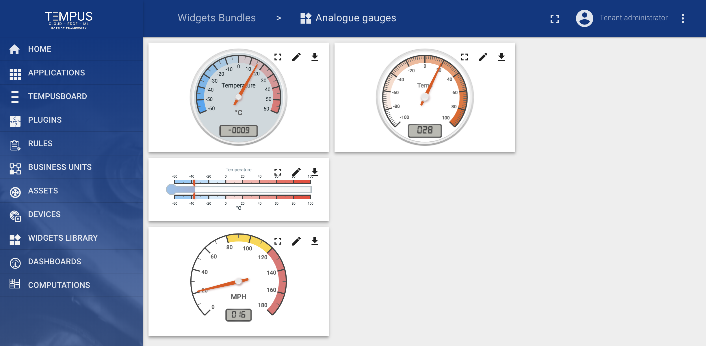

==============
Charts
==============

Useful for visualization of historical or real-time data with a time window.

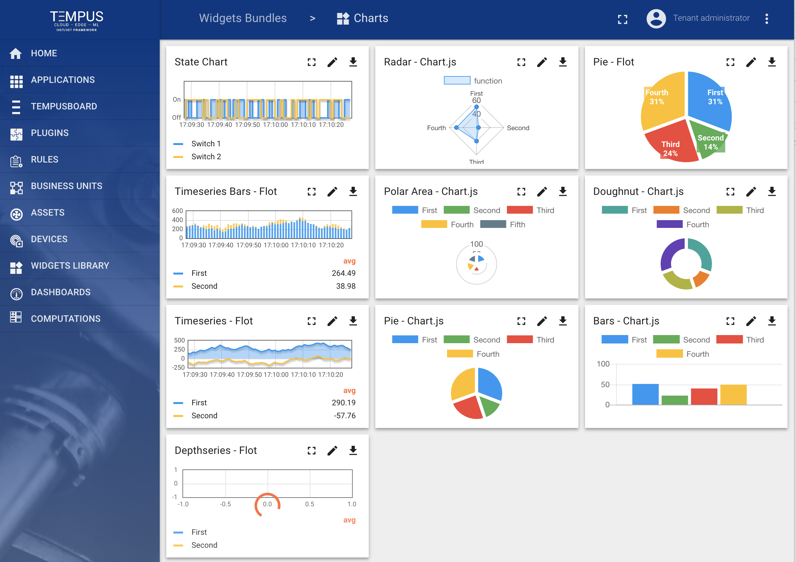

==============
GPIO widgets
==============

Useful for visualization and control of GPIO state for target devices.

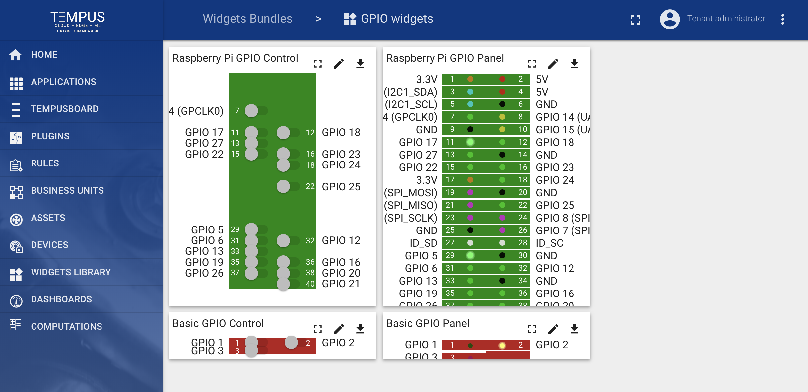

================
Control widgets
================

Useful for visualize current state and send RPC commands to target devices.

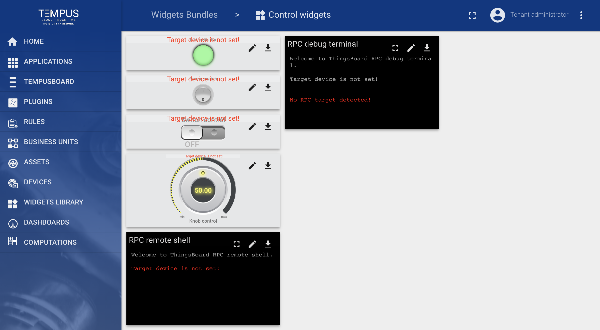

==============
Maps widgets
==============

Useful for visualization of devices geo locations and track devices routes both in real-time and history mode.

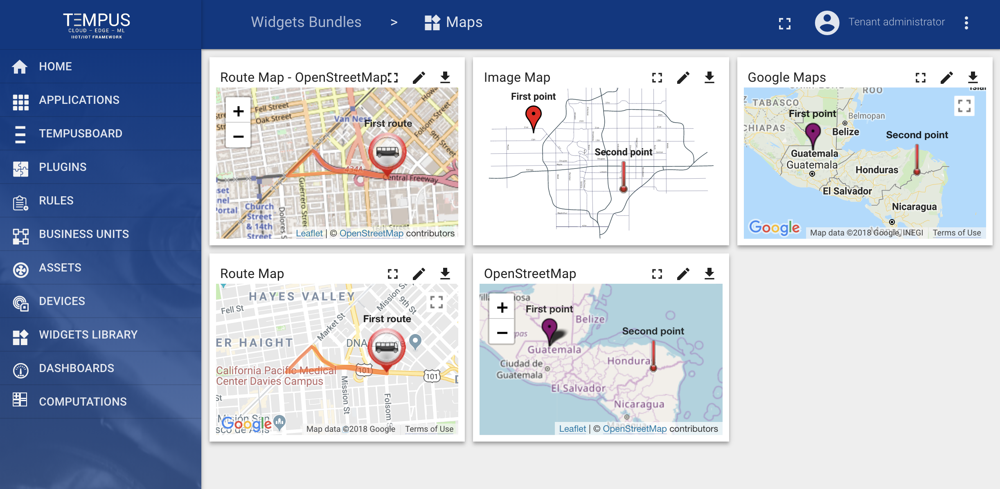

==============
Cards
==============

Useful for visualization of timeseries data or attributes in a table or card widget.

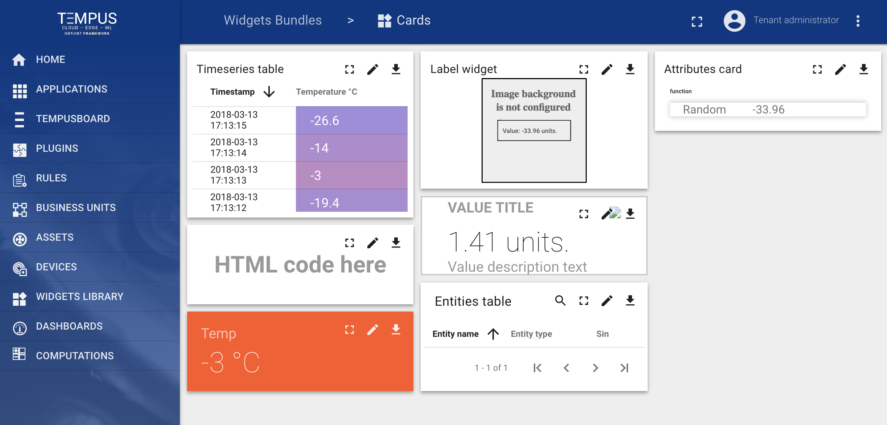

==============
Alarm widgets
==============

Useful for visualization of alarms for specific entities both in real-time and history mode.

*****************************
Widgets Bundles import/export
*****************************

Widgets Bundle export
=====================

You are able to export widgets bundle to JSON format and import it to the same or another Tempus instance.
In order to export widgets bundle, you should navigate to the Widgets Library page and click on the export button located on the particular widgets bundle card.

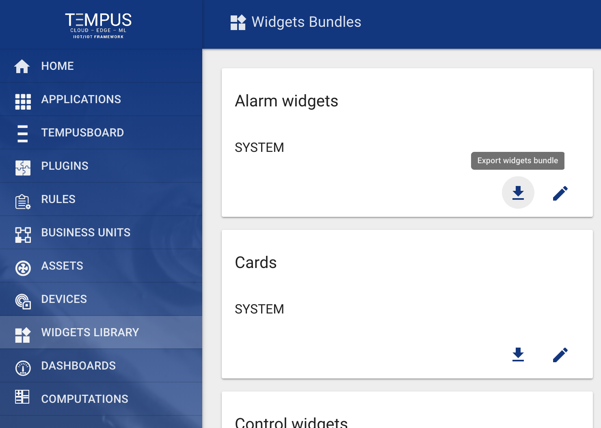

=====================
Widgets Bundle import
=====================

Similar, to import the widgets bundle you should navigate to the Widgets Library page and click on the big “+” button in the bottom-right part of the screen and then click on the import button.

.. image:: ../_images/admin/widgets_import_bundle.png
    :align: center
    :alt: Widgets Bundle export

The widgets bundle import window should a popup and you will be prompted to upload the json file.

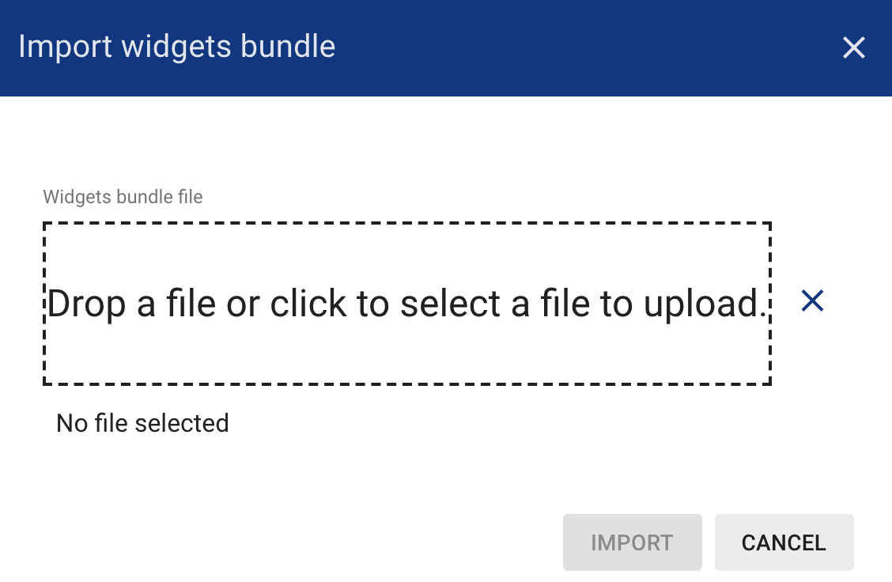

***************************
Widgets Types import/export
***************************

Widget Type export
==================

You are able to export particular widget type from widgets bundle to JSON format and import it to the same or another Tempus instance.
In order to export widget type, you should navigate to the Widgets Library page, then open desired widgets bundle and finally click on the export button located on the particular widget type card.

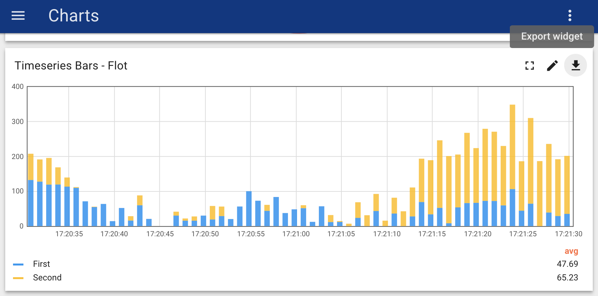

==================
Widget Type import
==================

Similar, to import the widget type you should navigate to the Widgets Library page, then open your widgets bundle and click on the big “+” button in the bottom-right part of the screen and then click on the import button.

.. image:: ../_images/admin/widget_type_import.png
    :align: center
    :alt: Widget Type import

The widget type import window will show a popup and you will be prompted to upload the json file.

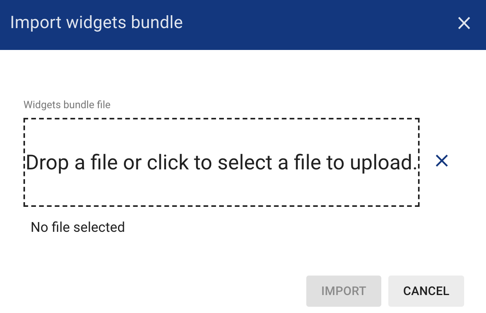