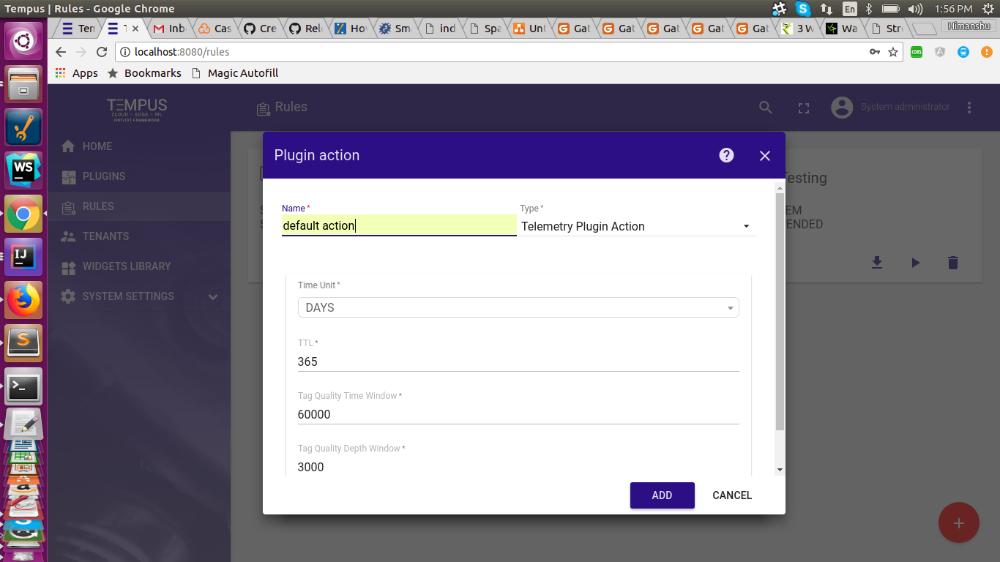

###############################
Streaming Data Quality Analysis
###############################

************
Introduction
************

Tempus supports the streaming data quality analysis, which means the meta data and quality information related to tags(i.e. keys) in
telemetry data can be processed and stored.

For quality timeseries and depthseires data is processed over a period of time and depth respectively and various aggregation constants
avg, mean, median etc are calculated and stored for timestamp and depthstamp for each tag.

*********************************
Configuration for Timeseries data
*********************************

* For timeseries data System telemetry plugin and rule is used.

* The action tab in the system telemetry rule consists of a configuration parameter **Tag Quality Time Window**.

This configuration is used to set the Time period over which processing will take place. Refer image:

**********************************
Configuration for Depthseries data
**********************************

* For depthseries data System telemetry plugin is used.

* Create a tenant rule for System telemetry plugin for depthseries data forwarding.

* In the action tab of this new rule created set this configuration parameter **Tag Quality Depth Window**.

This configuration is used to set the Depth period over which processing will take place.
