#############################
Provisioning Nifi WITSML FLOW
#############################

***************
Getting started
***************

This will guide you through how to provision nifi flow to fetch data for selective mnemonics for logs using nifi-witsml-bundle.

**********************
Setup and Requirements
**********************

You will need nifi-tempus-bundle and nifi-witsml-bundle for creating provisioning flow.
Clone nifi-tempus-bundle and nifi-witsml-bundle and build the respective maven projects. Finally copy the nar files to nifi lib directory.

- nifi-tempus-bundle : https://github.com/hashmapinc/nifi-tempus-bundle
- nifi-witsml-bundle : https://github.com/hashmapinc/nifi-witsml-bundle

***********************
Fetch Log Mnemonic List
***********************

1. On your nifi canvas create a flow as shown in image. This flow will let you fetch mnemonics for log object.

.. image:: ../_images/nifi/witsml/FetchMnemonicList.png
    :align: center
    :alt: Fetch Mnemonics

2. Configure ListObjects(GetLogs) processor as shown. This processor will fetch log meta-data with mnemonic list from Witsml server.

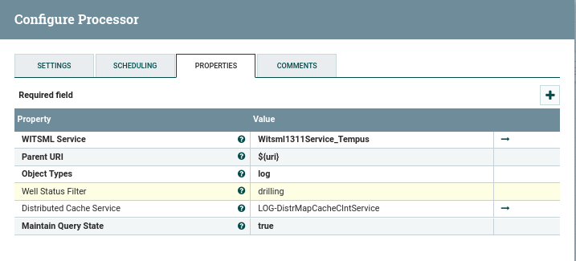

3. EvaluateJsonPath(PopulateAttributesFromJson) processor will add flowfile-attributes from logs json data. Configuration is being shown in image, don't forget to add the highlighted mnemonicList attribute.

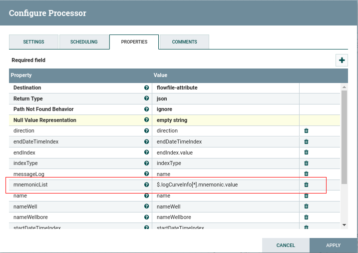

4. To validate the process you will need to list-queue between EvaluateJsonPath and LogToTempus. On attribute tab you can see mnemonicList as below.

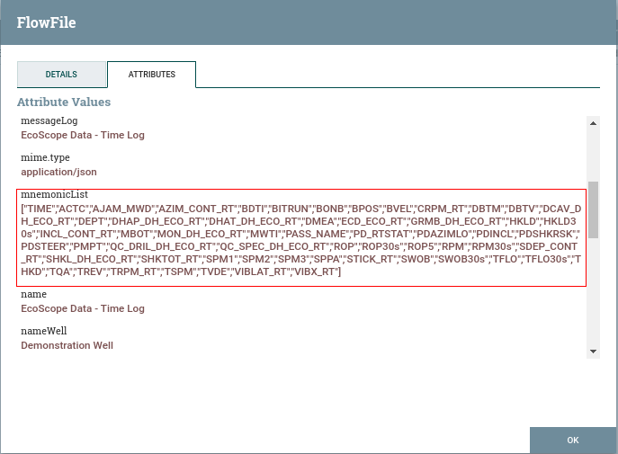

5. To convert the logs mnemonic list to Tempus gateway device attribute json format you will use LogToTempus Processor.
6. LogToTempus processor configuration are shown as follows.

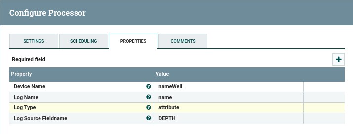

7. Finally configure PublishMqtt(AttributesToTempus) processor to publish the generated json to Tempus.

8. Move back to your Tempus UI, on that particular Well Device you can see client attributes as log mnemonics as shown in image.

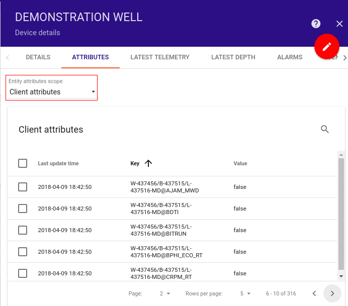

********************************************************
Fetch Data for selected Mnemonic using Tempus Attributes
********************************************************

1. Create a nifi flow as follows to subscribe to shared attributes of tempus device and store the list of mnemonics in a file.

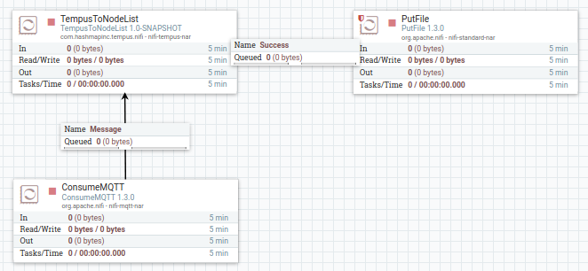

2. ConsumeMqtt processor will subscribe to Tempus Device Attribute topic for shared attributes :

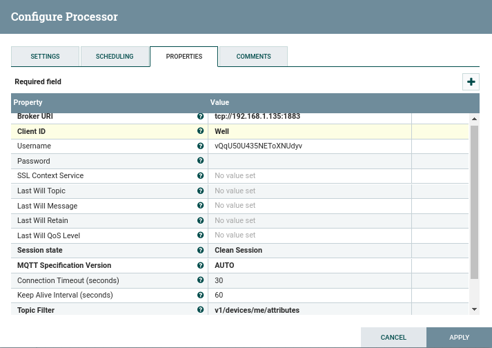

3. TempusToNodeList is processor from nifi-tempus-bundle will process the different types shared attributes json messages from tempus.

4. TempusToNodeList takes File path which will be used as storage for extracted node mnemonic list from Json messages. You also need to select the Data type as "WITSML".

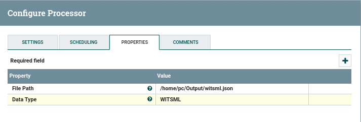

5. Output of TempusToNodeList will be passed on to PutFile processor to write/replace the updated node list to the storage file :

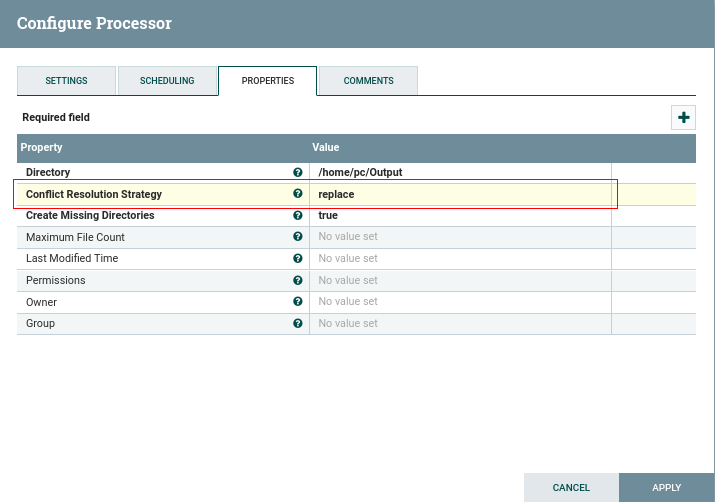

NOTE : Change the conflict Resolution Strategy to “replace”.

6. Start the nifi ConsumeMqtt processor and move back to Tempus UI.

7. Select the mnemonics from Tempus UI client attribute window for which you want to fetch data and click on SEND TO SHARED button :

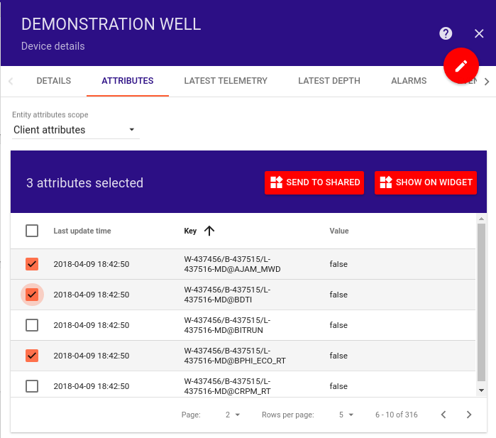

8. Selected mnemonics will be added to the shared attributes window of the device with their value as true :

.. image:: ../_images/nifi/witsml/SharedAttributes.png
    :align: center
    :alt: Device Shared Attributes

9. On the nifi side these attributes will be subscribed by ConsumeMqtt processor and passed on to the TempusToNodeList processor for processing and storing them in a storage file using PutFile.

********************************************************
Start fetching data for mnemonic list from witsml server
********************************************************

1. Create nifi flow to read witsml-storage file and pass the mnemonics list to WitsmlJsonToAttribute processor.

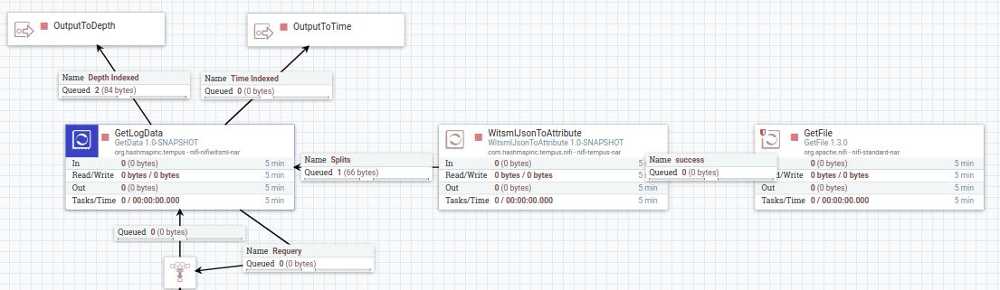

2. GetFile processor will read the storage file in which you have been putting mnemonics list in previous steps.

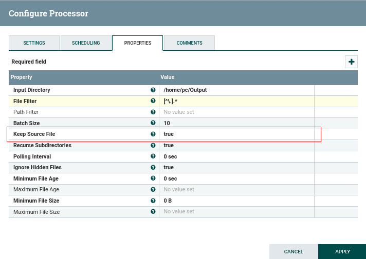

NOTE : make “Keep Source File” as true.

3. WitsmlJsonToAttribute will read the flowfile content and add wellId, wellboreId, logId, wellName and mnemonics as flowfile attributes.

4. Data from  WitsmlJsonToAttribute will be passed to GetData(GetLogData) processor. GetData processor will fetch data for only the selected mnemonics.

5. LogData from processor can be passed to LogToTempus processor to process the data and convert it into Tempus GatewayJson format. Finally this data can be published through PublishMqtt processor.