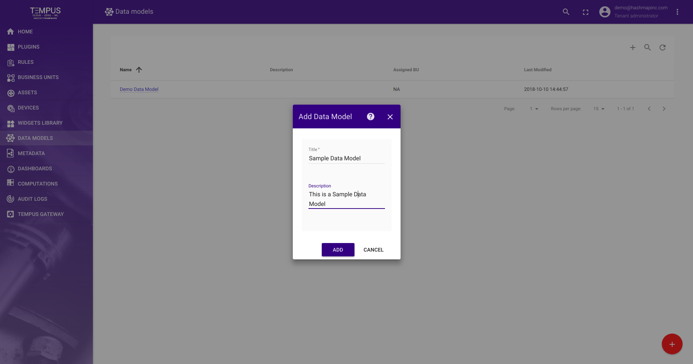
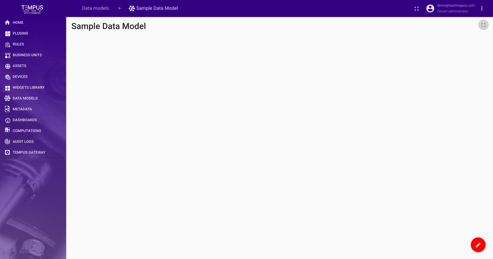
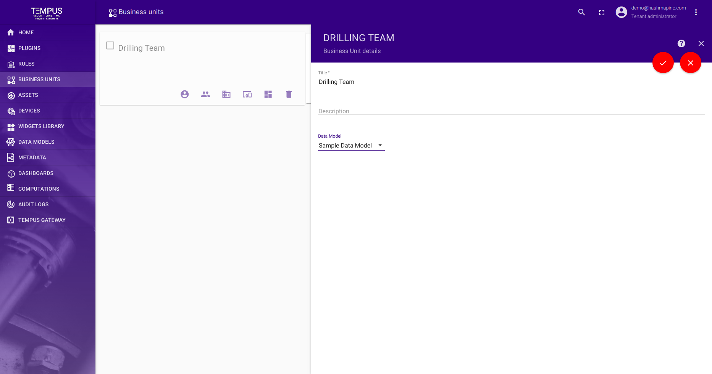
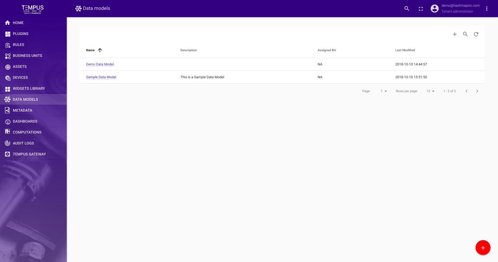

####################
Data Model Reference
####################

This reference document explains different actions and operation related to Data Model.
The document includes creation, updation, deletion and assignment of Data Model to different Business Units and creating Asset Landing Pages for DataModel Objects.

Data Model Information
======================

The page displays the overall created Data Model for login tenant admin.

Data Model Creation
===================

Click on orange button to Add a Data Model, a pop-up will open, fill in the details related to Data Model.
On clicking on Add button, you will be redirected to canvas for Adding DataModel Objects.

For adding DataModel Object refer DataModel Object Reference documentation.

.. toctree::
    :maxdepth: 1

    dataobject.rst

Assign Data Model to Business Unit
==================================

To assign a Data Model to a Business Unit, move to Business Unit tab and click on particular Business Unit card.
This will open a side navigation for Business Unit, now click on edit and select the Data Model from DataModel drop-down and finally apply changes.

Asset Landing Pages for Data Model Object
=========================================

For creating Asset Landing Pages refer to Asset Landing Page document.

.. toctree::
    :maxdepth: 1

    ../admin/assetlanding.rst

Results
=======

With that, we have created our Data Model.