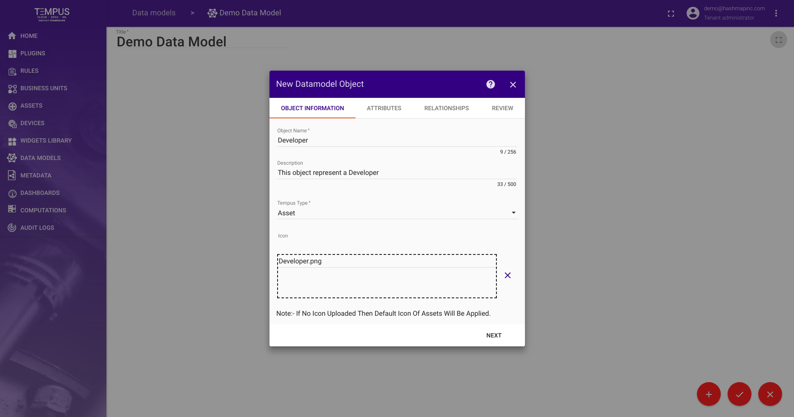
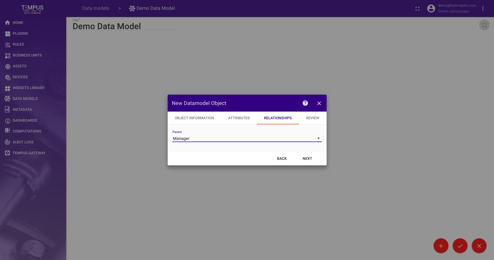

################
Object Reference
################

This reference explains the different parts of datamodel object creation.

|

Object Information
==================

The first page of the datamodel object creation stepper is for entering general object information. This includes:

- **Object Name** - the name of the object. This must be unique within a datamodel.
- **Object Description** - the optional description of the object.
- **Object Type** - the type of object this is. This can be either ``Device`` or ``Asset``.

For our example, let's create a ``Developer`` object.

|

Object Attributes
=================

.. image:: ../_images/datamodel/object-attributes.png
    :align: center

The Object Attributes section is where the attribute fields of this object are defined. For our ``Developer`` example object, we have created attributes for:

- ``Name`` - the name of the developer. This could be manually entered for each developer.
- ``Age`` - the age of the developer. This could be updated based on an external birthday metadata source.
- ``Heart Rate`` - the developer's heart rate. This could come from a fitness ``Device`` associated with the developer.
- ``Location`` - the location of the developer. This could come from a mobile ``Device`` associated with the developer.

The are of course just examples to illustrate how to use object attributes. We don't actually monitor the developers this closely (yet).

|

Object Relationships
====================

The Relationships section is where the datamodel object can define how it relates to other objects in the datamodel. 

At this point, only a ``Parent`` relationship is supported, but more general relationships will be supported in the future.

For our example, let's assume we have already created a ``Manager`` datamodel object that we would like to assign as the ``Parent`` of our ``Developer`` object.

|

Object Review
=============

.. image:: ../_images/datamodel/object-review.png
    :align: center

The Review section allows us to review the datamodel object we have defined. 

For our example, this looks right for our ``Developer`` object. We will accept by clicking ``Submit`` to save our object to the datamodel.

|

Results
=======

.. image:: ../_images/datamodel/object-results.png
    :align: center

With that, we have created our first small datamodel. This can be expanded to account for the devices associated with a ``Developer`` (macbook, fitness tracker, phone, etc...).