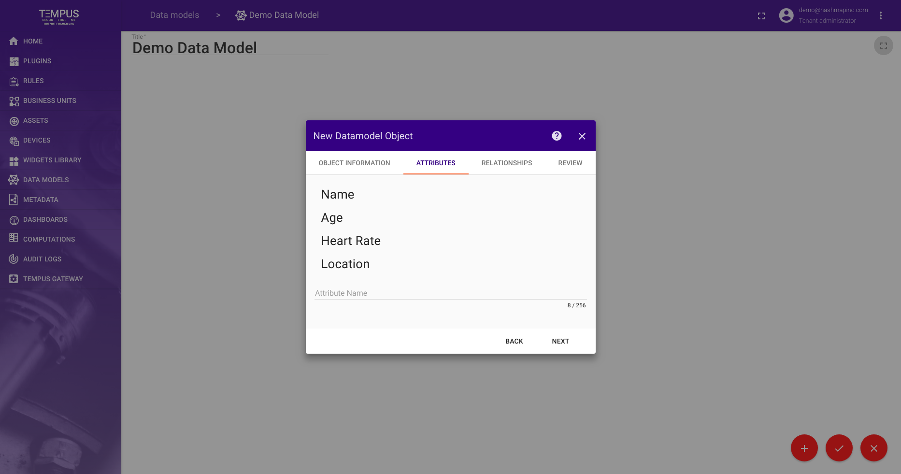
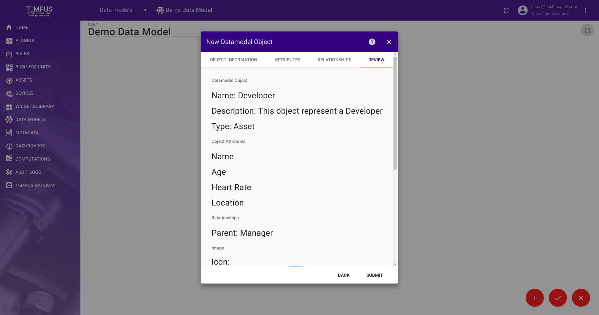
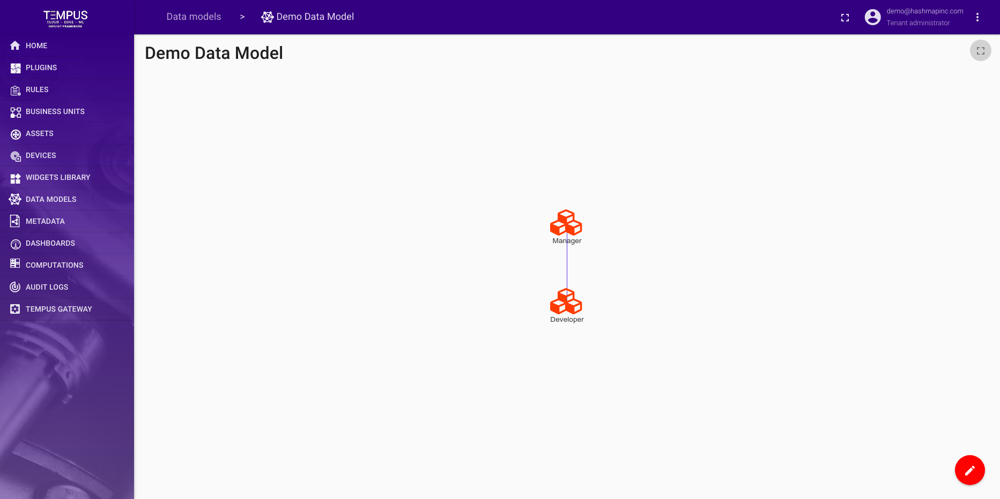

################
Object Reference
################

This reference explains the different parts of datamodel object creation.

Object Information
==================

.. image:: ../_images/datamodel/object-info.png
    :align: center

Object Attributes
=================

Object Relationships
====================

.. image:: ../_images/datamodel/object-relationships.png
    :align: center

Object Review
=============

Results
=======

