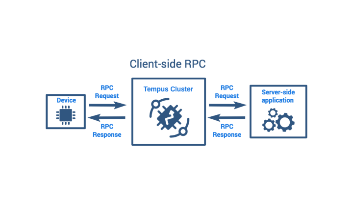
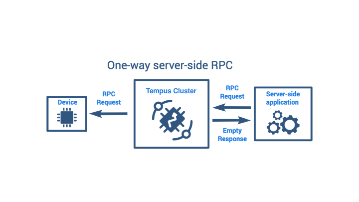
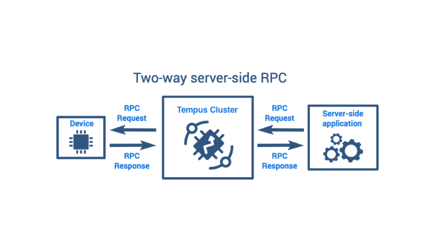

######################
Using RPC Capabilities
######################

Tempus Cloud allows you to send remote procedure calls (RPC) from server side applications to devices and vice versa. Basically, this feature allows you to send commands to devices and receive results of commands execution. Similar, you can execute request from the device, apply some calculations or other server-side logic on the back-end and push the response back to the device. This guide covers Tempus Cloud RPC capabilities. After reading this guide, you will get familiar with following topics:

* RPC call types
* Basic RPC use-cases
* RPC client-side and server-side APIs
* RPC widgets

**************
RPC Call Types
**************

Thinsboard RPC feature can be divided into two types based on originator: device-originated and server-originated RPC calls. In order to use more familiar names, we will name device-originated RPC calls as a client-side RPC calls and server-originated RPC calls as server-side RPC calls.

Server-side RPC calls can be divided into one-way and two-way:

* One-way RPC request is sent to the device without delivery confirmation and obviously, does not provide any response from the device. RPC call may fail only if there is no active connection with the target device within a configurable timeout period.

* Two-way RPC request is sent to the device and expects to receive a response from the device within the certain timeout. The Server-side request is blocked until the target device replies to the request.

**************
Device RPC API
**************

Tempus Cloud provides convenient API to send and receive RPC commands from applications running on the device. This API is specific for each supported network protocol. You can review API and examples in corresponding reference page:

.. toctree::
    :maxdepth: 1

    ../api/mqtt
    ../api/coap
    ../api/http

*******************
Server-side RPC API
*******************

Tempus Cloud provides System RPC Plugin that allows you to send RPC calls from server-side applications to the device. In order to send RPC request you need execute HTTP POST request to the following URL:

.. code-block:: bash

    http(s)://host:port/api/plugins/rpc/{callType}/{deviceId}

where

* **callTyp** is either **oneway** or **twoway**
* **deviceId** is your target device id

The request body should be a valid json object with two elements:

* **method** - method name, json string
* **params** - method parameters, json object

For example:

.. tabs::

    .. tab:: set-gpio-request.sh

        .. code-block:: bash

            curl -v -X POST -d @set-gpio-request.json http://localhost:8080/api/plugins/rpc/twoway/$DEVICE_ID \
            --header "Content-Type:application/json" \
            --header "X-Authorization: $JWT_TOKEN"

    .. tab:: set-gpio-request.json

        .. code-block:: json

            {
                "method": "setGpio",
                "params": {
                    "pin": "23",
                    "value": 1
                }
            }

**Please note** that in order to execute this request, you will need to substitute **$JWT_TOKEN** with a valid JWT token. This token should belong to either

* user with **TENANT_ADMIN** role
* user with **CUSTOMER_USER** role that owns the device identified by **$DEVICE_ID**

You can use following topic to get the token:

.. toctree::
    :maxdepth: 1

    ../api/swagger.rst

