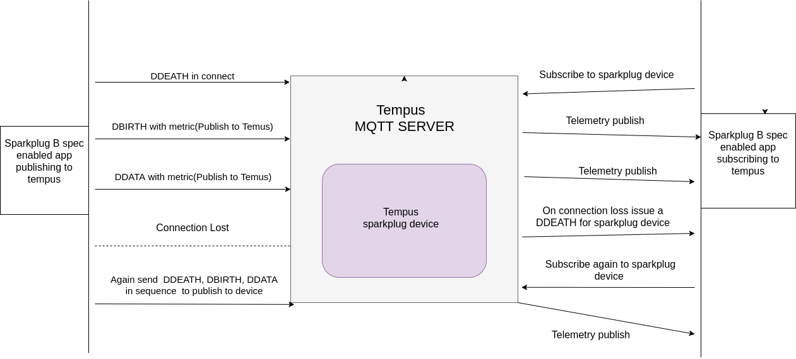

#######################################
Sparkplug B Specification(Spec) support
#######################################

***************
Getting Started
***************

Sparkplug basics
================

Sparkplug is a specification for MQTT enabled devices and applications to send and receive messages in a stateful way. While MQTT is stateful by nature it doesn't ensure that all data on a receiving MQTT application is current or valid. Sparkplug provides a mechanism for ensuring that remote device data is current and valid.

Sparkplug B specification specifies how various MQTT devices must connect and disconnect from the MQTT server i.e. Tempus in our case. This includes device lifecycle messages such as the required birth and last will & testament messages that must be sent to ensure the device lifecycle state and data integrity.

Sparkplug specification doc can be found here : https://s3.amazonaws.com/cirrus-link-com/Sparkplug+Specification+Version+1.0.pdf

Open source library used
========================

* We use cirrus link java client library for encoding and decoding the sparkplug B format data.
* Link of repo https://github.com/Cirrus-Link/Sparkplug.git
* This library internally uses Google protobuf for encoding/ decoding purpose.

Implementation
==============

In tempus the data gets published to devices through MQTT clients, so we primarily focus on the sparkplug message types related to device only i.e DBIRTH, DDATA, DDEATH. The state management for devices will also include usage of these message types.

The implementation is divided in the following stages:

* Persisting sparkplug b specification payload data to tempus devices(sparkplug devices).
* State management  for sparkplug devices on tempus side.
* Subscription of sparkplug b spec data devices on tempus by some external app.

Persisting sparkplug b specification payload data to tempus devices
===================================================================

* Tempus uses a gateway device to act as a bridge between external devices connected to different systems and Tempus. Gateway API provides the ability to exchange data between multiple devices and the platform using single MQTT connection.
* Publishing to a device through a gateway device results in creation of that device if it does not exists.
* Similarly a sparkplug B supported message would be published through a gateway device resulting in creation of new devices, if not already created, which are compliant with sparkplug B specification.
* The topic name for publish would be different for each of the sparkplug device compliant with topic name format defined in sparkplug B specification. For example the format structure is:

    **namespace\/group_id\/msg_type\/edge_node_id\/device_id**

  - The **namespace** element of the Topic Namespace is the root element that will define both the structure of the remaining namespace elements as well as the encoding used for the associated payload data.
  - The **group_id** element of the Topic Namespace provides for a logical grouping of MQTT EoN and Devices into the MQTT Server and back out to the consuming MQTT Clients.
  - The **message_type** element of the Topic Namespace provides an indication as to what the MQTT Payload of message will contain(DDEATH, DBIRTH, DDATA).
  - The **edge_node_id** element of the Sparkplug Topic Namespace uniquely identifies the MQTT EoN Node within the infrastructure.
  - The **device_id** element of the Sparkplug Topic Namespace identifies an MQTT Device attached to the MQTT EoN Node. In our case it would be the name of device.

* The device access token would be the gateway device token.

State management  for devices adhering to sparkplug b spec on tempus side
=========================================================================

* Dbirth, Ddeath, and Ddata messages would be used to manage the state of devices.
* For example if the client publishing loses connection with tempus mqtt server, the subscriber client connected to tempus mqtt server is sent a Ddeath msg.
* If the client comes up again to publish data, it should publish Dbirth again followed by Ddata otherwise the publish message would be discarded.
* Refer to the below diagram:

Subscription of sparkplug b spec data on tempus devices(sparkplug devices) by some external app
===============================================================================================

* Telemetry data for each of sparkplug device on tempus can be subscribed on a separate topic, whose name is as per the sparkplug specification.
* The subscriber would be able to see the telemetry data if the telemetry data is being published to that sparkplug device at that point of time.

Usage/ Testing the sparkplug B spec support in Tempus
=====================================================

* To test the sparkplug B spec support on Tempus, we need to have something which publishes data to tempus in sparkplug B format.
* For this purpose we can again use the open source cirrus link sparkplug repo.
* Standalone sparkplug example for java i.e. SparkplugExample.java can be slightly modified for publishing as well as subscribing telemetry data to and from Tempus.

