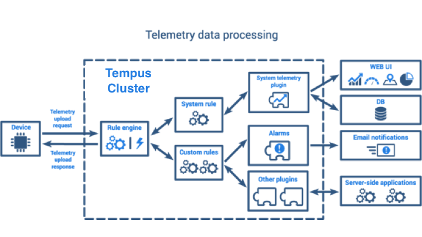

###########################
Working with Telemetry Data
###########################

Tempus Cloud provides a rich set of features related to telemetry data:

* **collect** data from devices using MQTT, CoAP or HTTP protocols.
* **store** timeseries data in Cassandra (efficient, scalable and fault-tolerant NoSQL database).
* **query** latest timeseries data values or all data within the specified time interval.
* **subscribe** to data updates using websockets (for visualization or real-time analytics).
* **visualize** timeseries data using configurable and highly customizable widgets and dashboards.
* **filter** and analyze data using flexible Rule Engine (/docs/user-guide/rule-engine/).
* **generate** alarms based on collected data.
* **forward** data to external systems using plugins (e.g. Kafka or RabbitMQ plugins).

This guide provides an overview of the features listed above and some useful links to get more details.

***************************
Device telemetry upload API
***************************

Tempus Cloud provides an API to upload timeseries key-value data. Flexibility and simplicity of key-value format allow easy and seamless integration with almost any IoT device on the market. Telemetry upload API is specific for each supported network protocol. You can review API and examples in corresponding reference page:

.. toctree::
    :maxdepth: 1

    ../api/mqtt
    ../api/coap
    ../api/http

****************
Telemetry Plugin
****************

Tempus Cloud consists of core services and pluggable modules called plugins. Telemetry plugin is responsible for persisting timeseries data to internal data storage; provides server-side API to query and subscribe for data updates. Since Telemetry plugin functionality is critical for data visualization purposes in dashboards, it is configured on the system level by a system administrator. Advanced users or platform developers can customize telemetry plugin functionality.

Internal data storage
=====================

Tempus Cloud uses either Cassandra NoSQL database or SQL database to store all data.
A device that is sending data to the server will receive confirmation about data delivery as soon as data is stored in DB. Modern MQTT clients allow temporary local storage of undelivered data. Thus, even if one of the Tempus Cloud nodes goes down, the device will not lose the data and will be able to push it to other servers.
Server side applications are also able to publish telemetry valued for different entities and entity types.
Although you can query the database directly, Tempus Cloud provides set of RESTful and Websocket API that simplify this process and apply certain security policies:

* Tenant Administrator user is able to fetch data for all entities that belong to the corresponding tenant.
* Customer user is able to fetch data only for entities that are assigned to the corresponding customer.

Data Query API
==============

Telemetry plugin provides following API to fetch entity data:

Timeseries data keys API
************************

You can fetch list of all data keys for particular entity type and entity id using GET request to the following URL

.. code-block:: bash
    
    http(s)://host:port/api/plugins/telemetry/{entityType}/{entityId}/keys/timeseries

.. tabs::

    .. tab:: get-telemetry-keys.sh

        .. code-block:: bash
            
            curl -v -X GET http://localhost:8080/api/plugins/telemetry/DEVICE/ac8e6020-ae99-11e6-b9bd-2b15845ada4e/keys/timeseries \
            --header "Content-Type:application/json" \
            --header "X-Authorization: $JWT_TOKEN"
    
    .. tab:: get-telemetry-keys-result.json
        
        .. code-block:: json

            ["gas","temperature"]

Supported entity types are: TENANT, CUSTOMER, USER, RULE, PLUGIN, DASHBOARD, ASSET, DEVICE, ALARM

Timeseries data values API
**************************

You can fetch list of latest values for particular entity type and entity id using GET request to the following URL

.. code-block:: bash
    
    http(s)://host:port/api/plugins/telemetry/{entityType}/{entityId}/values/timeseries?keys=key1,key2,key3

.. tabs::

    .. tab:: get-telemetry-keys.sh

        .. code-block:: bash
            
            curl -v -X GET http://localhost:8080/api/plugins/telemetry/DEVICE/ac8e6020-ae99-11e6-b9bd-2b15845ada4e/values/timeseries?keys=gas,temperature \
            --header "Content-Type:application/json" \
            --header "X-Authorization: $JWT_TOKEN"
    
    .. tab:: get-telemetry-keys-result.json
        
        .. code-block:: json

            {
                "gas": [
                    {
                    "ts": 1479735870786,
                    "value": "1"
                    }
                ],
                "temperature": [
                    {
                    "ts": 1479735870786,
                    "value": "3"
                    }
                ]
            }

Supported entity types are: TENANT, CUSTOMER, USER, RULE, PLUGIN, DASHBOARD, ASSET, DEVICE, ALARM

You can also fetch list of historical values for particular entity type and entity id using GET request to the following URL

.. code-block:: bash
    
    http(s)://host:port/api/plugins/telemetry/{entityType}/{entityId}/values/timeseries?keys=key1,key2,key3&startTs=1479735870785&endTs=1479735871858&interval=60000&limit=100&agg=AVG

The supported parameters are described below:

* **keys** - comma separated list of telemetry keys to fetch.
* **startTs** - unix timestamp that identifies start of the interval in milliseconds.
* **endTs** - unix timestamp that identifies end of the interval in milliseconds.
* **interval** - the aggregation interval, in milliseconds.
* **agg** - the aggregation function. One of MIN, MAX, AVG, SUM, COUNT, NONE.
* **limit** - the max amount of data points to return or intervals to process.

Tempus Cloud will use startTs, endTs and interval to identify aggregation partitions or sub-queries and execute asynchronous queries to DB that leverage built-in aggregation functions.

.. tabs::

    .. tab:: get-telemetry-values.sh

        .. code-block:: bash
            
            curl -v -X GET "http://localhost:8080/api/plugins/telemetry/DEVICE/ac8e6020-ae99-11e6-b9bd-2b15845ada4e/values/timeseries?keys=gas,temperature&startTs=1479735870785&endTs=1479735871858&interval=60000&limit=100&agg=AVG" \
            --header "Content-Type:application/json" \
            --header "X-Authorization: $JWT_TOKEN"
    
    .. tab:: get-telemetry-values-result.json
        
        .. code-block:: json

            {
                "gas": [
                    {
                    "ts": 1479735870786,
                    "value": "1"
                    },
                    {
                    "ts": 1479735871857,
                    "value": "2"
                    }
                ],
                "temperature": [
                    {
                    "ts": 1479735870786,
                    "value": "3"
                    },
                    {
                    "ts": 1479735871857,
                    "value": "4"
                    }
                ]
            }

Supported entity types are: TENANT, CUSTOMER, USER, RULE, PLUGIN, DASHBOARD, ASSET, DEVICE, ALARM

Websocket API
*************

Websockets are actively used by Thingsobard Web UI. Websocket API duplicates REST API functionality and provides the ability to subscribe to device data changes. You can open a websocket connection to a telemetry plugin using the following URL

.. code-block:: bash
    
    ws(s)://host:port/api/ws/plugins/telemetry?token=$JWT_TOKEN

Once opened, you can send subscription commands and receive subscription updates:

* **cmdId** - unique command id (within corresponding websocket connection)
* **entityType** - unique entity type. Supported entity types are: TENANT, CUSTOMER, USER, RULE, PLUGIN, DASHBOARD, ASSET, DEVICE, ALARM
* **entityId** - unique entity identifier
* **keys** - comma separated list of data keys
* **timeWindow** - fetch interval for timeseries subscriptions, in milliseconds. Data will be fetch within following interval [now()-timeWindow, now()]
* **startTs** - start time of fetch interval for historical data query, in milliseconds.
* **endTs** - end time of fetch interval for historical data query, in milliseconds.

Example
-------

Change values of the following variables :

* token - to the JWT token which you can get using the following link.
* entityId - to your device id.

In case of live-demo server :

* replace host:port with demo-Tempus Cloud.io and choose secure connection - wss://

In case of local installation :

* replace host:port with 127.0.0.1:8080 and choose ws://

.. code-block:: html

    <!DOCTYPE HTML>
    <html>
    <head>

        

    </head>
    <body>

    

        <a href="javascript:WebSocketAPIExample()">Run WebSocket</a>
    

    </body>
    </html>
