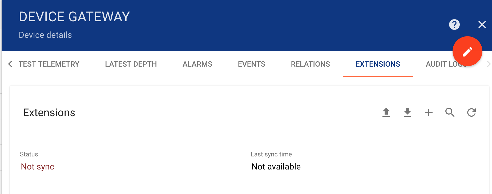

#################
Gateway Extension
#################

This section will help you to configure various gateway extensions.

####################
How to add extension
####################

Click on device of type gateway. Go to extension tab at top-right corner by clicking on '>'.
Then, Click on the “+” button at the top-right corner of the page.

.. toctree::
    :maxdepth: 1

    witsml