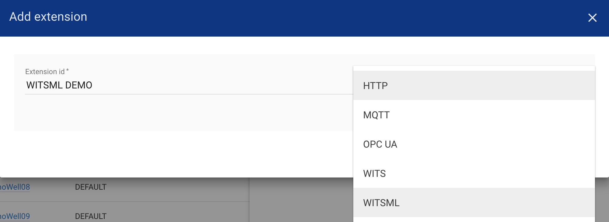
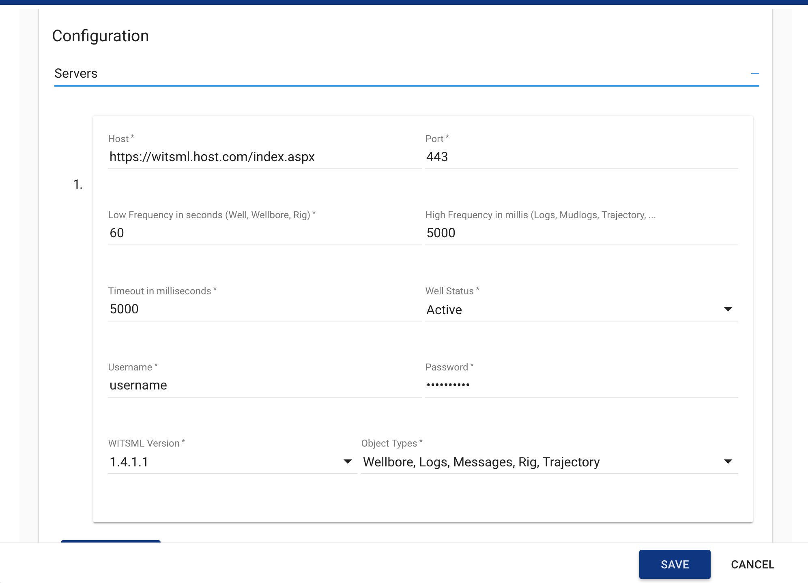

################
WITSML Extension
################

This section will help you to configure WITSML gateway extension.

####################
Add WITSML Extension
####################

After clicking on add extension, add name and type of extension as shown below:

##############################
WITSML Extension Configuration
##############################

Following WITSML properties can be configure:

* **host** - WITSML server url (without http or https protocol)
* **port** - WITSML server port to connect
* **lowFrequencyInSeconds** - scanning interval for low frequency witsml objects
* **highFrequencyInMillis** - scanning interval for high frequency witsml objects (growing objects like log, trajectory)
* **username** / **password** - access credentials
* **version** - WITSML version (currently two versions are supported, 1.3.1.1 & 1.4.1.1)
* **objectTypes** - type of objects to be fetch
* **wellStatus** - status of well to be fetch
* **wellIdTobeScanned** - scanning witsml objects for single well id (Default is empty i.e. to scan all wells and related witsml objects)

Here is the sample configuration:

