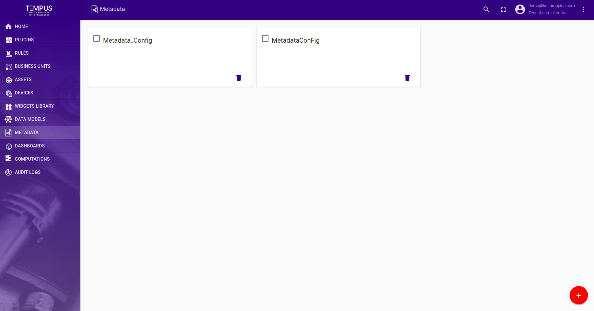
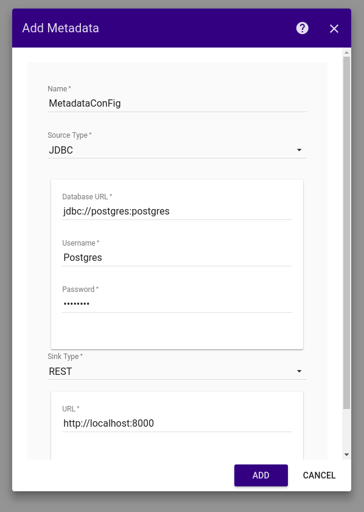
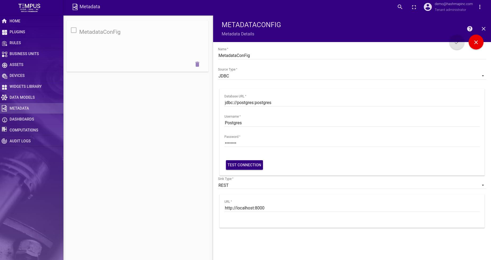
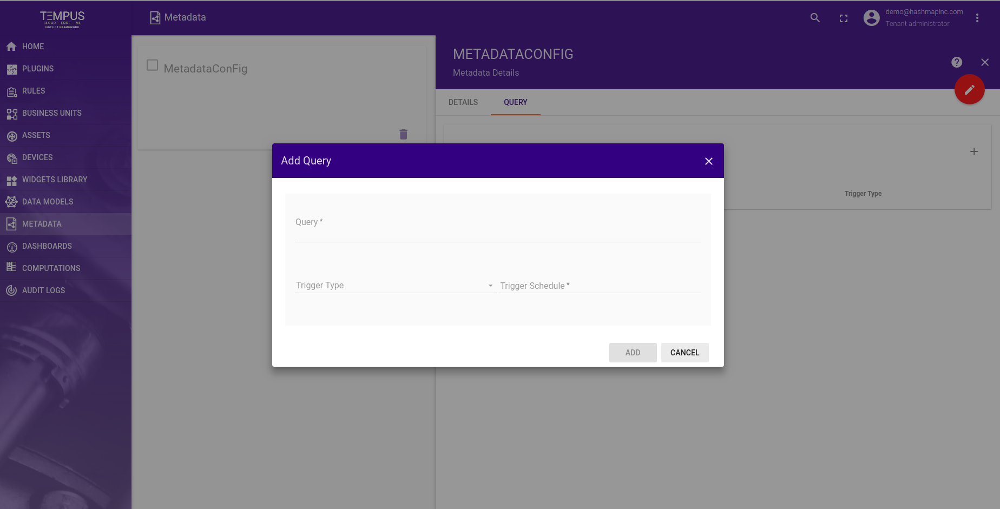

#######
Metadata
#######

This guide describes how to configure metadata. In metadata User can set source and sink type.
User can add queries in metadata. Metadata is microservice written in HashMap Analytic framework.

Add Metadata
==================

User can create metadata configuration by entering information. This includes:

- **Metadata Name** - The name of the metadata configuration.
- **Source Type** - Metadata will be pull from source.User need to select source type.User can select JDBC.Once source type is selected user can add source detail which includes database url,username and password.
- **Sink Type** - Pulled metadata will be push in set sink details.User need to select sink type and set url of sink type.

Edit Metadata
=================

User can edit metadata configuration,delete metadata configuration and also Test connection with source.

Add Query
====================

User can add queries by clicking on Query tab in detail sidenav.Query includes following:

- **Query** - Valid query.
- **Trigger Type** - By default CRON trigger type is supported in trigger type.
- **Trigger Schedule** - Cron expression can be set as trigger schedule.

User can edit and delete added queries.
