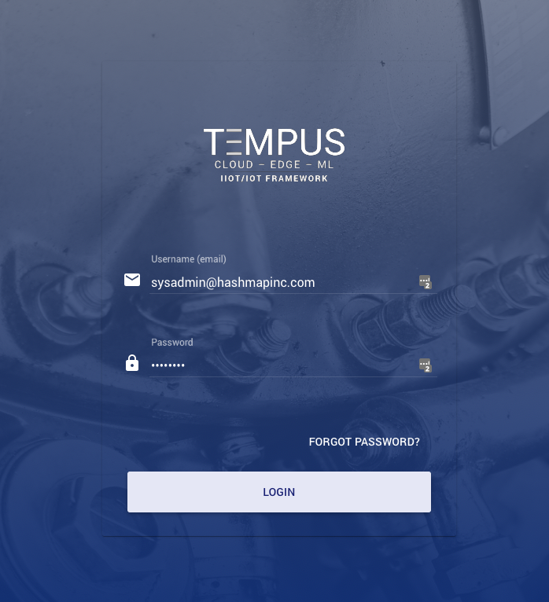
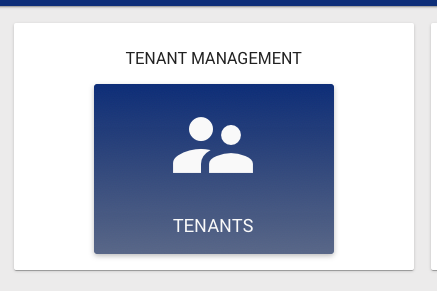
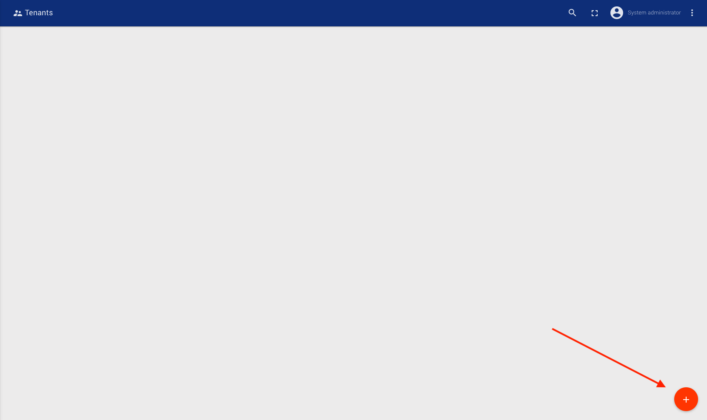
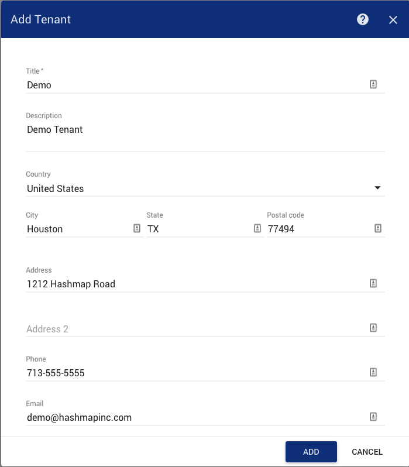
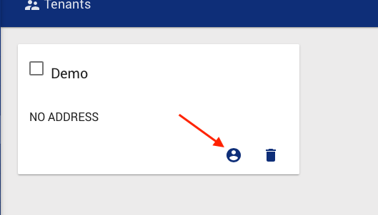
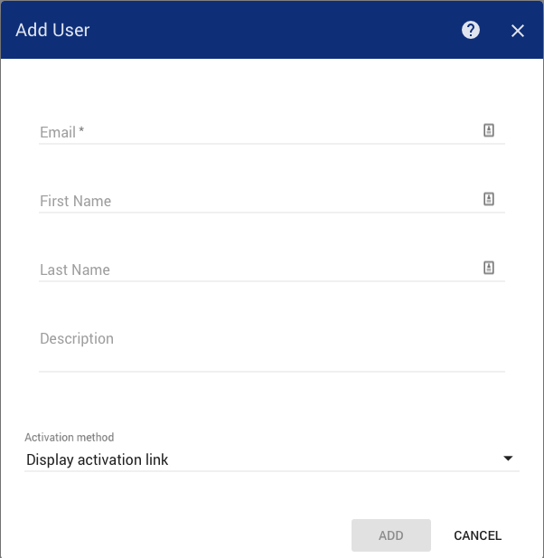
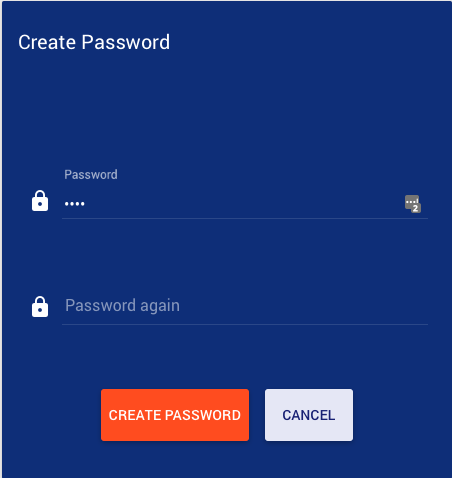

###############
Create a Tenant
###############

This will guide you though how to create a tenant in Tempus Cloud.

**********************
Setup and Requirements
**********************

If you don’t have access to a running Tempus Cloud instance please follow this guide:

.. toctree::
    :maxdepth: 1

    ../install/linux

Create a Tenant
===============

1. Navigate to the login page for Tempus Cloud (by default http://host_ip:8080, where host ip is the address running Tempus)

2. Login with the following credentials:
    * User: sysadmin@hashmapinc.com
    * Password: sysadmin

    **Please Note**: This password **MUST** be changed prior to production

3. Click on **Tenants** under **TENANT MANAGEMENT**

4. Click on the "+" icon at the bottom right of the screen to add a tenant

5. Fill in the required information, and then click Add

Create a Tenant Administrator
=============================

1. After performing the steps to create a tenant, navigate to the Tenants page and click on the user button of the tenant card that you want to create the administrator for.

2. Click on the "+" symbol at the bottom right to create an administrator

3. Enter in the Tenant admin info as required

The user can be activated in one of 2 ways:

* **Display Activation Link**: Useful for when the email server has not been configured, or it is not a real user
* **Send Activation Mail**: Will send an email to the user with the supplied email address to complete the activation process

We will choose the Display Activation Link option.

4. Follow the activation link and create a password, and then click Create Password

5. You have now created the Tenant admin and should be logged in as the Tenant Administrator after activation

