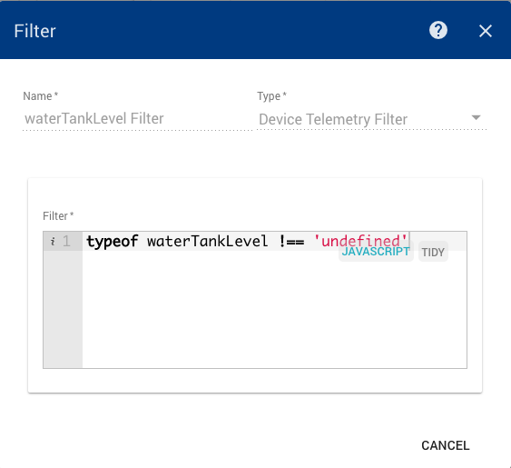

#######################
Device Telemetry Filter
#######################

********
Overview
********

This component allows filtering incoming telemetry messages by their values. This filter is very useful if you want to apply rule based on certain values of telemetry. For example, an engine controller may periodically report its temperature. When engine temperature is higher than 100 degrees you may raise an alert. The filter expression is written in javascript.

*************
Configuration
*************

You are able to write boolean javascript expression using bindings that match keys of your telemetry message. If you are not sure that certain key is present in your message, you can add check it’s type for undefined. For example, filter below will match if temperature is higher then 100 degrees.

.. code-block:: javascript

    typeof temperature !== 'undefined' && temperature > 100

Assuming following telemetry message uploaded from engine controller device:

.. code-block:: json

    {"temperature":1100, "enabled":true, "mode":"A"}

The following filter will match if device is enabled, operating in mode ‘A’ and temperature is greater than 1000 degrees

.. code-block:: javascript

    temperature > 1000 && enabled == true && mode == 'A'

If you are not sure that all telemetry data points are present in the message, you should use the following syntax that adds all necessary “null” checks

.. code-block:: javascript

    typeof temperature!== 'undefined' && typeof enabled !== 'undefined' && typeof mode !== 'undefined' && 
    temperature > 1000 && enabled == true && mode == 'A'

*******
Example
*******

