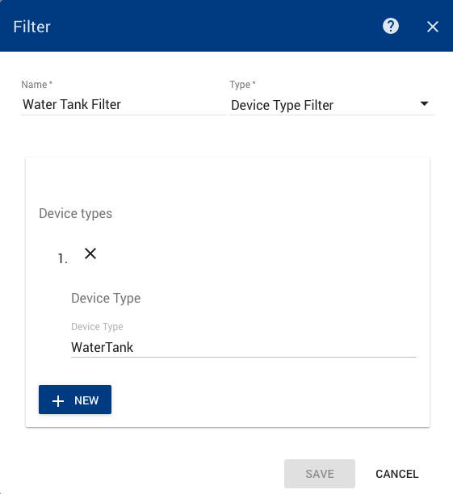

##################
Device Type Filter
##################

********
Overview
********

This component allows for filtering data based on the Device Type of the device that the data originated from.

*************
Configuration
*************

You are able to add one or more device types to the filter. Simply click the **+ NEW** button and add the device type to filter on. 

*******
Example
*******

